<header>

# AutoE2E: Open-Loop Evaluation of a Map- and Oracle-Route-Conditioned Temporal BEV Planner #

## Authors{.author}

Ryota Yamada

Amazon Web Services, Inc. Autoware Foundation Robotaxi Working Group (AutoE2E), github.com/autowarefoundation/auto_e2e, Apache-2.0

## Abstract{.abstract lang="en"}

When a policy consumes an HD map and a route at runtime, a camera-only benchmark omits modalities the policy was designed to use. We evaluate AutoE2E, a UniAD-inspired but narrower temporal BEV planner, under a runtime-modality-matched but oracle-route condition: the route corridor and destination are reconstructed retrospectively from the logged whole-scene trajectory. A frozen ResNet-50 BEVFormer V2 T8 camera BEV is fused with separately encoded 14-channel map and 2-channel route rasters through a channel-wise gate and deformable cross-attention; a GRU predicts 64 acceleration/curvature steps. The external KITScenes protocol supplies 4.0 s of real egomotion history, left-zero-padded to 6.4 s, and valid targets through 5.0 s. On KITScenes Val v3.5 (117 scenes, 11,035 samples), deterministic replay of published controls gives KITScenes Epoch 5 the lowest reported means at 2, 3 and 5 s (5 s ADE/FDE: 1.9405/5.5645 m), while Epoch 7 is lowest at 1 s. Internal validation shows that Epoch 7 increases a censored projected-progress proxy while increasing 6.4 s error and lowering comfort; strict route-corridor success is 0.061–0.076 and drivable-area success 0.414–0.444. The camera-only KITScenes Test track is a different scene population and is not a map or route ablation. No statistical significance or causal navigation-input gain is claimed. A paired same-scene Camera / Camera+Map / Camera+Map+Route evaluation remains required.

## Keywords{.keyword lang="en"}

end-to-end autonomous driving, temporal BEV, HD-map conditioning, route conditioning, open-loop evaluation, KITScenes, nuPlan

</header>

## Introduction

End-to-end (E2E) driving research has developed largely around camera-only open-loop evaluation on nuScenes . UniAD  and VAD  demonstrated planning-oriented integrated stacks in this setting, with temporal BEV representations such as BEVFormer  providing a shared basis. Deployed vehicle policies, however, often receive more than cameras. The deployment contract of AutoE2E supplies an HD-map raster and a selected-route raster at every step in addition to camera images. Evaluating this policy only on a camera-only benchmark reports behavior under a condition that omits information the policy was designed to consume. Conversely, reporting only the map-and-route condition would hide behavior when navigation inputs are unavailable. These evaluations answer different questions and should remain separate.

This paper makes a deliberately modest claim. We have not yet run an experiment showing that maps and routes causally improve planning accuracy. What we do present is (i) an evaluation protocol whose primary benchmark uses the input set that matches the deployment contract (Camera + HD Map + Route) while retaining a camera-only condition as a separate track, (ii) the results measured under that protocol for four training checkpoints, (iii) implementation facts verified against the source code and the checkpoint registration metadata, (iv) the trade-offs among short-horizon accuracy, long-horizon accuracy, route progress, drivable-area compliance, and comfort observed in internal validation, and (v) the specification of the same-scene controlled experiment that a causal claim would require.

<figure class="fig col-span-2" id="fig-arch">
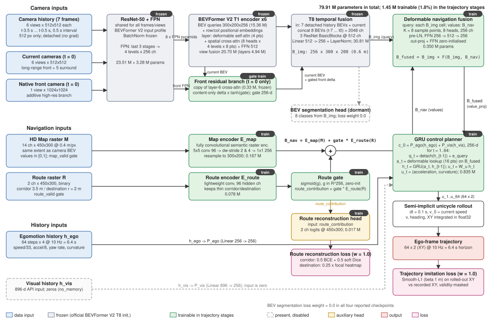
<figcaption>The evaluated AutoE2E configuration (bevformer_v2_t8_split_navigation_v5). At each of eight times, six 512×512 camera views are processed: the current time plus seven history times. A 1024×1024 front view is added only at the current time. A frozen ResNet-50 + FPN and six-layer single-frame BEVFormer V2 encoder are applied independently per time, followed by T8 convolutional fusion across the eight BEVs; a navigation pathway that encodes the 14-channel map and the 2-channel route separately, gated summation, deformable navigation fusion, 6.4 s of ego-motion history, a GRU control planner, and unicycle integration. All reported counts are parameter counts measured by instantiating the implementation (79,906,522 total; 1,448,582 trainable). Dashed boxes denote branches that are present in the checkpoint but disabled.</figcaption>
</figure>

This paper is organized around the following five research questions (RQs). RQ1: on the deployment-aligned KITScenes Val protocol, where camera, HD map, and route are all available, with what accuracy does the route-conditioned policy predict the ego trajectory? RQ2: on the same KITScenes Val scenes, how does the KITScenes fine-tuned checkpoint compare with the nuPlan-trained checkpoint? RQ3: how does performance change on the camera-only KITScenes Test track, which is a different scene population? RQ4: across training epochs, what trade-offs emerge among short-horizon accuracy, long-horizon accuracy, route progress, drivable-area compliance, and comfort? RQ5: given the current evidence, what can and cannot be said about the effect of the HD map and the route?

We limit our contributions to the following four points. First, a source-code-verified description and an exact parameter budget for a planning-oriented model that combines separately encoded HD map and route rasters with a frozen BEVFormer V2 T8 camera BEV through a gated residual (, ). Second, an evaluation protocol that separates the primary benchmark, aligned with the deployment contract, from the camera-only secondary track, and that clearly distinguishes deterministic overlay replay, which does not re-run the model, from checkpoint internal validation (). Third, results from eight external evaluations of four checkpoints together with internal validation (–). Fourth, the specification of the same-scene controlled experiment required for a causal claim about map and route effects, plus an audit table enumerating the evidence behind each claim (appendix).

## Related Work

### Unified End-to-End Driving

UniAD  introduced a planning-oriented design in which detection, tracking, mapping, motion forecasting, occupancy prediction, and planning are linked through query interaction so that every task contributes to the final plan. VAD  replaced the scene with a vectorized representation to reduce computation, and TransFuser  fused camera and LiDAR features with a transformer and evaluated the result in closed-loop CARLA. AutoE2E does not reproduce this complete task chain. It inherits the idea of organizing a shared BEV representation toward planning, while narrowing its scope to temporal camera BEV, explicit navigation context, auxiliary route reconstruction, and direct ego planning. We do not compare against UniAD on a common benchmark and make no claim of superiority or inferiority.

### Temporal BEV Encoders

BEVFormer  aggregates multi-camera features into BEV spatiotemporally using learnable BEV queries and deformable attention derived from Deformable DETR . BEVFormer v2  adapts modern image backbones to BEV perception through perspective supervision, and releases an official ResNet-50 checkpoint together with a temporal configuration that fuses multi-frame BEV by convolution. The frozen camera pathway in this paper starts from the official R50 T8 checkpoint, resizes the BEV queries and positional embeddings to a 300×200 grid, and loads the weights with the detection head excluded.

### Map- and Route-Conditioned Planning

ChauffeurNet  rendered the road map and the intended route as rasters and used them as inputs for imitation learning. VectorNet  and LaneGCN  encoded HD maps as vectors and lane graphs, showing that map structure governs motion-forecasting accuracy. The UniAD-family baselines evaluated on the KITScenes  E2E benchmark are conditioned on discrete navigation commands (turn left, turn right, go straight), whereas the route used here is a raster consisting of a lane-sequence corridor over a Lanelet2  map together with a destination marker. Isolating the effect of route conditioning on planning requires a same-scene controlled experiment, whose specification we give in the appendix.

### Evaluation Protocols

Open-loop planning evaluation on nuScenes has repeatedly been shown to admit shortcuts by which high scores can be obtained from the ego state alone . Closed-loop evaluation in nuPlan , non-reactive simulation in NAVSIM , the finding that rule-based planners can rival learned planners , and conditioning-signal shortcut biases  all indicate that the definition of the evaluation condition itself shapes the conclusions. This paper remains in the open-loop setting, but adopts three design principles: align the evaluation inputs with the deployment contract, distinguish deterministic replay that does not re-run the model from internal validation, and do not read differences between distinct scene populations as causal effects.

## Problem Setting and Requirements

### Deployment Contract

At every frame, the deployed AutoE2E policy receives the following: six-view camera images (the current frame plus 7 history frames at 0.5 s intervals, each 512×512), a 1024×1024 front camera image for the current frame, ego-centered HD map rasters (14 channels) and a selected-route raster (2 channels), and 6.4 s of ego-motion history at 10 Hz. The output is 6.4 s of acceleration and curvature at 10 Hz. The primary evaluation should therefore be conducted under the condition in which all of these inputs are available. At the same time, because situations in which the map or the route is missing can occur in operation, the behavior obtained from cameras alone is worth measuring as a separate track. The two tracks answer different questions.

### Principle of Evaluation Separation

(1) The primary benchmark is KITScenes Val v3.5, where Camera + HD Map + Route are all available, and the numbers are computed over the 117 scenes and 11,035 samples that satisfy strict identity with the official Map and Route evaluation. (2) Because the KITScenes Test v1.0 configuration does not release maps, it is evaluated as a camera-only robustness and transfer track over all 206 scenes and 23,690 samples. (3) Since Val and Test have different scene populations, the Test-versus-Val difference is not interpreted as a causal effect of the map and route. (4) The external evaluation is a replay of the published deterministic control overlays; it does not re-run the model and contains no route counterfactual inputs, input gradients, or route-reconstruction outputs. (5) Checkpoint internal validation is a separate protocol and is not mixed into the same ranking table.

<figure class="table col-span-2" id="tab-position">
<figcaption>Positioning relative to representative E2E driving systems. ◯: applicable, —: not applicable, n/a: not judged from the evidence in this paper. This table delineates the scope of our claims and does not indicate relative performance.</figcaption>
<table class="small">
<thead><tr><th>System</th><th class="c">Camera-only primary evaluation</th><th class="c">HD map input</th><th class="c">Route input</th><th class="c">Temporal BEV</th><th class="c">Unified detection / tracking / occupancy</th><th class="c">Closed-loop evaluation</th><th class="c">Evaluation data</th></tr></thead>
<tbody>
<tr><td>UniAD </td><td class="c">◯</td><td class="c">— (online map estimation)</td><td class="c">Navigation command</td><td class="c">◯</td><td class="c">◯</td><td class="c">—</td><td class="c">nuScenes</td></tr>
<tr><td>VAD </td><td class="c">◯</td><td class="c">— (vector map estimation)</td><td class="c">Navigation command</td><td class="c">◯</td><td class="c">Partial</td><td class="c">◯ (CARLA)</td><td class="c">nuScenes / CARLA</td></tr>
<tr><td>TransFuser </td><td class="c">— (camera + LiDAR)</td><td class="c">—</td><td class="c">Target point</td><td class="c">—</td><td class="c">Auxiliary tasks</td><td class="c">◯ (CARLA)</td><td class="c">CARLA</td></tr>
<tr><td>AutoE2E (this paper)</td><td class="c">— (secondary track)</td><td class="c">◯ (14-ch raster)</td><td class="c">◯ (2-ch raster)</td><td class="c">◯ (T8, 3.5 s)</td><td class="c">— (BEV segmentation head disabled)</td><td class="c">—</td><td class="c">KITScenes Val / Test, nuPlan internal</td></tr>
</tbody>
</table>
</figure>

## Method

The description in this section is based on facts confirmed by reading the source code of the evaluated branch and by instantiating the model under the same configuration. Symbols in the equations correspond to .

### Temporal Camera BEV

The camera pathway builds on the official BEVFormer V2 R50 T8 checkpoint . A four-level, 256-channel feature pyramid is formed from the last three stages of ResNet-50 , and a six-layer BEVFormer encoder updates 300×200 learned BEV queries (256-dimensional, 15.36 M parameters) (). The BEV grid covers X from −60 m to 120 m and Y from −60 m to 60 m in ego coordinates, with 0.6 m cells (). Each layer consists of deformable self-attention over two queues obtained by duplicating the current BEV (8 heads, 4 points each), multi-scale spatial cross-attention that maps reference points at four pillar heights (z ∈ [−5, 3] m) into the images through a calibrated projection operator (8 heads, 4 levels, 8 points each), a 512-dimensional FFN, and three LayerNorms. The projection operator implements pinhole and fisheye (F-theta) models, so this evaluation is not calibration-free.

<figure class="fig" id="fig-geometry">
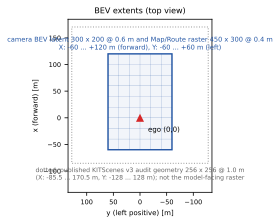
<figcaption>BEV spatial extents. The camera BEV latent (300×200, 0.6 m) and the map and route rasters fed to the model (450×300, 0.4 m) cover the same extent (X: −60 to 120 m, Y: −60 to 60 m). The dotted outline is the published 256×256, 1.0 m geometry audited in KITScenes v3, not the raster the model receives in this evaluation.</figcaption>
</figure>

In the T8 temporal configuration, seven history frames at 0.5 s intervals (t−3.5 s to t−0.5 s) and the current frame are passed through the same backbone and encoder, with gradients detached for the history BEVs. The eight BEVs are concatenated into 2048 channels, passed through a three-block ResNet-style fusion module with 512 intermediate channels, and projected to 256 channels by a linear layer to obtain B_img (Eq. ). The camera pathway therefore observes 3.5 s at 2 Hz, a temporal span different from the 6.4 s ego-motion history described below ().

$$B_{\mathrm{img}} = T\left(B_{-7}, B_{-6}, \ldots, B_{-1}, B_{0}\right)$$

<figure class="fig col-span-2" id="fig-temporal">
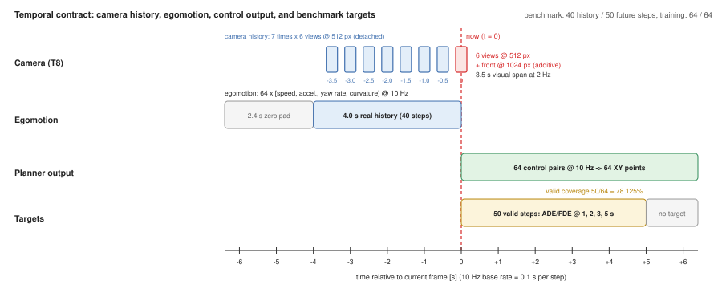
<figcaption>Temporal contract. The camera branch uses 8 frames at 0.5 s intervals (3.5 s), the ego-motion history uses 64 steps at 10 Hz (6.4 s), and the output is 64 steps at 10 Hz (6.4 s). Under the KITScenes benchmark protocol, only 40 history steps (4.0 s, the remainder zero-padded) and 50 future steps (5.0 s) are real data, so the effective horizon coverage of external replay is 50/64 = 78.125%, and 6.4 s ADE/FDE cannot be obtained from external replay.</figcaption>
</figure>

<figure class="fig col-span-2" id="fig-encoder">
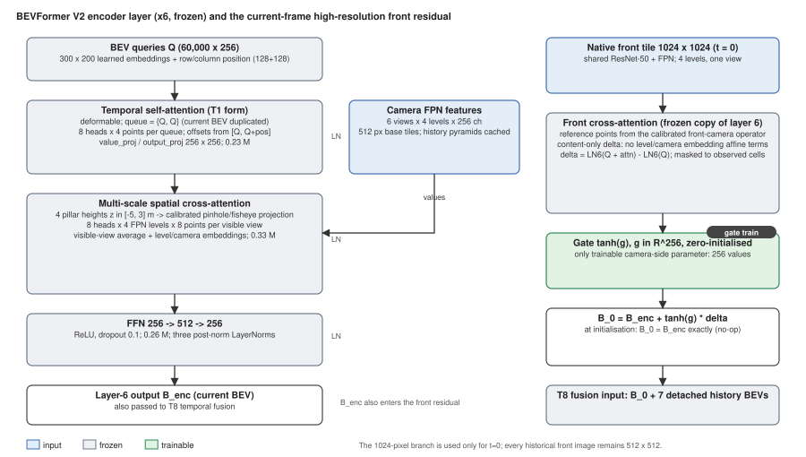
<figcaption>BEVFormer V2 encoder layer (left, six layers, frozen) and the front-camera residual branch (right). The front branch is a frozen copy of the last layer's cross-attention that computes only a content-dependent delta from the 1024×1024 current front image, multiplies it by the tanh of a zero-initialized 256-dimensional gate, and adds it to the current BEV. It is exactly the identity at initialization, and this gate is the only camera-side parameter that remains trainable after freezing. History frames use 512×512 only.</figcaption>
</figure>

### Asymmetric-resolution front branch

The current-frame front camera is additionally processed at 1024×1024. The usual 512 px front view remains in the all-view encoder, while a branch consisting of a frozen copy of the last encoder layer's cross-attention computes a content-dependent delta δ from the high-resolution front features and adds it as B_0 = B_enc + tanh(g) ⊙ δ. Since g is 256-dimensional and zero-initialized, the output of the pre-trained camera pathway is unchanged at the start of training. These 256 parameters are the only camera-side parameters excluded from freezing. No 1024 px images are used for history frames.

### Navigation rasters

The HD map and the route are represented as ego-centric semantic rasters. The rasters fed to the evaluated checkpoints are 450×300 cells at 0.4 m/px, covering the same extent as the camera BEV (X: −60 to 120 m, Y: −60 to 60 m). The semantics of the 14 map-raster channels and the 2 route-raster channels are given in , and their rendering on a real KITScenes Val v3.5 sample in . Binary channels store 1, direction channels store (sin θ + 1)/2 and (cos θ + 1)/2, and road level stores (clip(level, −8, 8) + 8)/16, so all values lie in [0, 1]. The route corridor is drawn from the sequence of lane centerlines with a width of 3.5 m (truncated 10 m behind the ego vehicle), and the destination marker is a circle of radius 2.0 m. Map validity and route validity are explicit per-sample gates, and invalid rasters are multiplied by zero. Route conditioning can be disabled either in the checkpoint or at evaluation time, enabling controlled comparisons on the same scene.

<figure class="table col-span-2" id="tab-channels">
<figcaption>Definitions of the 14 map-raster channels and 2 route-raster channels (extracted from the implementation of the native C++ rasterizer and the lanelet fitter). The right columns report the mean occupancy and the number of non-empty samples over the 30 KITScenes Val v3.5 samples obtained by our deterministic scan (Appendix A.5); they are not dataset-wide statistics.</figcaption>
<table class="small">
<thead><tr><th>ch</th><th>Name</th><th>Source primitive (Lanelet2 )</th><th>Value</th><th class="num">Mean occupancy [%]</th><th class="num">Non-empty / 30</th></tr></thead>
<tbody>
<tr><td>0</td><td>Drivable area</td><td>Lanelet polygons (excluding crosswalks)</td><td>binary</td><td class="num">15.55</td><td class="num">30</td></tr>
<tr><td>1</td><td>Lane boundary</td><td>Left and right boundary lines (width 1.0 m)</td><td>binary</td><td class="num">8.29</td><td class="num">30</td></tr>
<tr><td>2</td><td>Lane centerline</td><td>Centerline (width 1.0 m)</td><td>binary</td><td class="num">5.52</td><td class="num">30</td></tr>
<tr><td>3</td><td>Intersection</td><td>Lanelet polygons with a turn_direction attribute</td><td>binary</td><td class="num">1.46</td><td class="num">28</td></tr>
<tr><td>4</td><td>Crosswalk</td><td>Polygons of subtype crosswalk</td><td>binary</td><td class="num">0.96</td><td class="num">24</td></tr>
<tr><td>5</td><td>Stop line</td><td>Stop-line polylines (width 1.0 m)</td><td>binary</td><td class="num">0.18</td><td class="num">27</td></tr>
<tr><td>6</td><td>Static traffic light</td><td>Positions of traffic_light regulatory elements (radius 1.0 m)</td><td>binary</td><td class="num">0.07</td><td class="num">26</td></tr>
<tr><td>7</td><td>Heading sin</td><td>Centerline orientation (width 3.5 m)</td><td>(sin+1)/2</td><td class="num">14.72</td><td class="num">30</td></tr>
<tr><td>8</td><td>Heading cos</td><td>Same as above</td><td>(cos+1)/2</td><td class="num">14.72</td><td class="num">30</td></tr>
<tr><td>9</td><td>Heading valid</td><td>Same as above</td><td>binary</td><td class="num">14.72</td><td class="num">30</td></tr>
<tr><td>10</td><td>Known map area</td><td>Map boundary polygon</td><td>binary</td><td class="num">96.98</td><td class="num">30</td></tr>
<tr><td>11</td><td>Road level</td><td>layer / level attributes</td><td>(level+8)/16</td><td class="num">0.00</td><td class="num">0</td></tr>
<tr><td>12</td><td>Road level valid</td><td>Same as above</td><td>binary</td><td class="num">0.00</td><td class="num">0</td></tr>
<tr><td>13</td><td>Overlapping-level ambiguity</td><td>Overwrites by a different level, or mismatch with the route level</td><td>binary</td><td class="num">0.00</td><td class="num">0</td></tr>
<tr class="group"><td>R0</td><td>Selected route corridor</td><td>Centerlines of the route lane sequence (width 3.5 m, truncated 10 m behind)</td><td>binary</td><td class="num">1.45</td><td class="num">28</td></tr>
<tr><td>R1</td><td>Destination marker</td><td>Route endpoint (radius 2.0 m)</td><td>binary</td><td class="num">0.05</td><td class="num">26</td></tr>
</tbody>
</table>
</figure>

<figure class="fig" id="fig-channels">
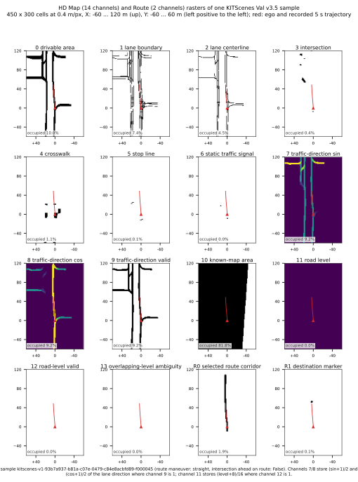
<figcaption>The 14 map channels and 2 route channels for one KITScenes Val v3.5 sample (450×300, 0.4 m/px). These are real data taken from the dataset artifacts of the public dashboard; red marks the ego position and the recorded 5 s trajectory. The sample selection rule is given in Appendix A.5. Across the 30 scanned samples, the road-level channels 11–13 were all empty.</figcaption>
</figure>

The KITScenes route is the lane sequence obtained by fitting the ego trajectory over the whole scene to the Lanelet2 map, and the destination is the ego position at the end of the scene (). The future ego points themselves are not drawn, but the route is a retrospectively determined sequence of already-driven lanes, that is, it equals the intent the driver actually followed. Because this fact bears directly on how route conditioning should be interpreted, we return to it in Section 7.

<figure class="fig col-span-2" id="fig-route">
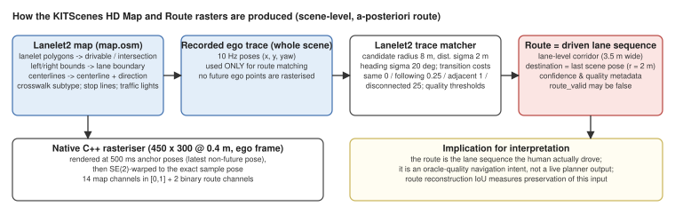
<figcaption>Generation of the map and route rasters in KITScenes. Primitives are extracted from the Lanelet2 map, and the ego trajectory over the whole scene is fitted to a lane sequence using HMM-like transition costs to yield the route. Rasters are drawn at anchor poses spaced 500 ms apart and warped to each sample pose by an SE(2) transform. The route is not the output of a live route planner but a retrospective lane-level driving intent.</figcaption>
</figure>

### Separate encoding and gated addition

The static map and the selected route have separate encoders (). The map encoder E_map is a fully convolutional network in which a 5×5 convolutional stem (96 channels) and a context path reduced to strides 2 and 4 by depthwise convolutions (192 channels) are aligned to 256 channels by 1×1 projections and added, with the input bilinearly resampled to 300×200. The route encoder E_route is a lightweight convolutional network with 96 hidden channels, designed so that the thin route corridor and the destination features are not lost to coarse pooling. The route contribution is controlled by a 256-dimensional per-channel gate and added to the encoded map (Eq. ). The gate g is zero-initialized, so the weight at the start of training is 0.5.

$$B_{\mathrm{nav}} = E_{\mathrm{map}}(M) + \sigma(g) \odot E_{\mathrm{route}}(R)$$

<figure class="fig col-span-2" id="fig-navfusion">
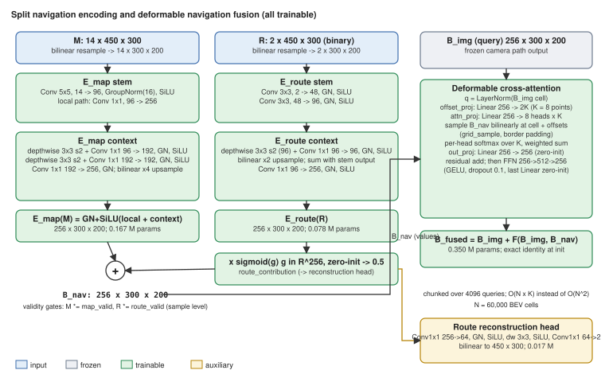
<figcaption>Internal structure of the separate navigation encoding and the deformable navigation fusion. Left: map encoder E_map (0.167 M) and route encoder E_route (0.078 M), the per-channel gate, and the addition. Right: deformable cross-attention that uses each cell of B_img as a query and samples 8 points on B_nav (8 heads, 256 channels, 0.350 M). The output projection and the final linear layer of the FFN are zero-initialized, so the fusion is exactly the identity at the start of training. The gated route contribution feeds the route reconstruction head (0.017 M).</figcaption>
</figure>

### Deformable navigation fusion

The navigation BEV is fused into the camera BEV by deformable cross-attention  (Eq. ). Each image-BEV cell acts as a query, predicts 8 offsets from its own position as the reference point, bilinearly samples B_nav, and aggregates the samples with 8-head softmax weights. This design reduces what would be O(N²) for dense cross-attention over 60,000 cells to O(NK). Because the output projection and the final linear layer of the FFN are zero-initialized, the fusion is residual and does not alter the representation of the pre-trained camera pathway at the start of training. This acts as a stabilization mechanism when attaching new navigation features to a frozen visual BEV representation.

$$B_{\mathrm{fused}} = B_{\mathrm{img}} + F_{\mathrm{deform}}\left(B_{\mathrm{img}}, B_{\mathrm{nav}}\right)$$

### Ego-motion history and GRU control planner

The ego-motion history h_ego is the flattened 256-dimensional vector of [speed, acceleration, yaw rate, curvature] over 64 steps at 10 Hz, with speed normalized by 33 m/s and acceleration by 8 m/s². In KITScenes it is derived from finite differences of the pose sequence, and curvature is the yaw rate divided by the speed lower-bounded at 0.1 m/s. The model API retains an 896-dimensional visual history input h_vis, but the evaluated checkpoints use enable_world_model = false and temporal_memory_mode = no_memory, so h_vis is fed with zeros. JEPA training, a learned world model, and a learned 6.4 s visual history encoder are absent from these checkpoints.

<figure class="fig col-span-2" id="fig-planner">
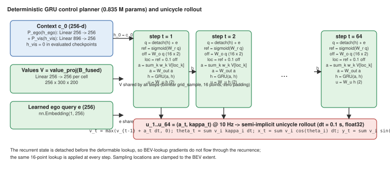
<figcaption>Deterministic GRU control planner (0.835 M) and unicycle integration. The initial state is the sum of linear projections of the ego-motion history and the visual history. At each step, sampling locations are predicted from the sum of the recurrent state (gradients detached) and a learned ego query, 16 points on the fused BEV are aggregated to update the GRU, and acceleration and curvature are emitted. This procedure is repeated for 64 steps.</figcaption>
</figure>

The planner is a deterministic GRU (). The Bezier and flow-matching planners present in the repository are not used in the evaluated checkpoints. The initial context c_0 is given by Eq. ; at each future step, 16 points on the fused BEV are attended to deformably (Eq. ), and the GRU updates its state and emits acceleration and curvature (Eqs. , ). This is repeated for 64 steps.

$$c_0 = P_{\mathrm{ego}}(h_{\mathrm{ego}}) + P_{\mathrm{vis}}(h_{\mathrm{vis}})$$

$$a_t = A_{\mathrm{deform}}\left(q_t, B_{\mathrm{fused}}\right), \quad q_t = \mathrm{sg}(h_{t-1}) + e$$

$$h_t = \mathrm{GRU}\left(a_t, h_{t-1}\right)$$

$$u_t = W_u h_t = \left(a^{\mathrm{acc}}_t, \kappa_t\right)$$

### Unicycle integration

Evaluation and the training loss convert the control sequence into ego-frame XY with a semi-implicit unicycle model. The time step is Δt = 0.1 s, the initial speed is the current speed v_0, and speed is clipped to be non-negative (Eq. ). The integration is carried out in float32. No implementation-specific clipping values exist other than the one on speed.

$$v_t = \max\left(v_{t-1} + a^{\mathrm{acc}}_t \Delta t, 0\right),\;
\theta_t = \sum_{i \le t} v_i \kappa_i \Delta t,\;
x_t = \sum_{i \le t} v_i \cos\theta_i \Delta t,\;
y_t = \sum_{i \le t} v_i \sin\theta_i \Delta t$$

### Auxiliary tasks and training objectives

The route reconstruction head decodes two channels of logits at 450×300 from the gated route contribution, supervised by the mean of BCE and soft Dice for the corridor and by a heatmap focal loss (weight 0.25) for the destination. The trajectory loss is the Smooth-L1 (β = 1 m) between the integrated XY and the recorded trajectory, averaged over valid steps. All four reported checkpoints were trained with a trajectory weight of 1.0, a route reconstruction weight of 1.0, and a BEV segmentation weight of 0.0. A BEV segmentation head (8 classes) exists in the checkpoints, but the reported checkpoints are not jointly optimized with BEV segmentation. The perception branch and the world-model branch are also disabled.

### Parameter budget

 and  report parameter counts obtained by instantiating the model in the same configuration (6 views). Of the 79,906,522 total parameters, 78,293,196 (97.98%) belong to the camera-BEV pathway. In total-capacity terms, the model is therefore almost entirely a pretrained, frozen visual representation: T8 temporal fusion accounts for 38.56%, ResNet-50 for 29.42%, the learned BEV queries for 19.22%, the BEVFormer encoder layers for 6.18%, and the FPN for 4.10%. The 1,448,582 parameters updated during trajectory training (1.81% of the model) are allocated to the GRU planner (835,380; 57.67% of trainable parameters), deformable navigation fusion (350,288; 24.18%), Map/Route encoders (245,440; 16.94%), route-reconstruction head (17,218; 1.19%), and front residual gate (256; 0.02%). Thus, the system does not train all 79.91 M parameters for planning; it trains a 1.45 M task-specific layer on top of a large frozen camera-BEV representation. The difference of 512 from the 79,907,034 parameters recorded for the repository's 8-view benchmark configuration matches two additional camera embeddings.

<figure class="table" id="tab-params">
<figcaption>Parameter counts for the evaluated configuration (measured by instantiating the implementation). Trainable denotes parameters with requires_grad true during the trajectory training stage.</figcaption>
<table class="small">
<thead><tr><th>Component</th><th class="num">Parameters</th><th class="c">State</th></tr></thead>
<tbody>
<tr><td>ResNet-50 backbone</td><td class="num">23,508,032</td><td class="c">frozen</td></tr>
<tr><td>Feature pyramid (4 levels)</td><td class="num">3,278,592</td><td class="c">frozen</td></tr>
<tr><td>BEV queries 300×200×256</td><td class="num">15,360,000</td><td class="c">frozen</td></tr>
<tr><td>Row, column, level, and camera embeddings</td><td class="num">66,560</td><td class="c">frozen</td></tr>
<tr><td>Pseudo-projection matrix (unused in calibrated evaluation)</td><td class="num">12</td><td class="c">frozen</td></tr>
<tr><td>Encoder, 6 layers (823,488 per layer)</td><td class="num">4,940,928</td><td class="c">frozen</td></tr>
<tr><td>Front cross-attention (copy)</td><td class="num">328,960</td><td class="c">frozen</td></tr>
<tr><td>Front residual gate</td><td class="num">256</td><td class="c">trained</td></tr>
<tr><td>T8 temporal fusion</td><td class="num">30,809,856</td><td class="c">frozen</td></tr>
<tr><td>Map encoder E_map</td><td class="num">167,200</td><td class="c">trained</td></tr>
<tr><td>Route encoder E_route</td><td class="num">77,984</td><td class="c">trained</td></tr>
<tr><td>Route gate</td><td class="num">256</td><td class="c">trained</td></tr>
<tr><td>Deformable navigation fusion</td><td class="num">350,288</td><td class="c">trained</td></tr>
<tr><td>GRU control planner</td><td class="num">835,380</td><td class="c">trained</td></tr>
<tr><td>Route reconstruction head</td><td class="num">17,218</td><td class="c">trained</td></tr>
<tr><td>BEV segmentation head (weight 0.0)</td><td class="num">165,000</td><td class="c">frozen</td></tr>
<tr class="group"><td>Total / trainable</td><td class="num">79,906,522 / 1,448,582</td><td class="c">—</td></tr>
</tbody>
</table>
</figure>

<figure class="fig col-span-2" id="fig-params">
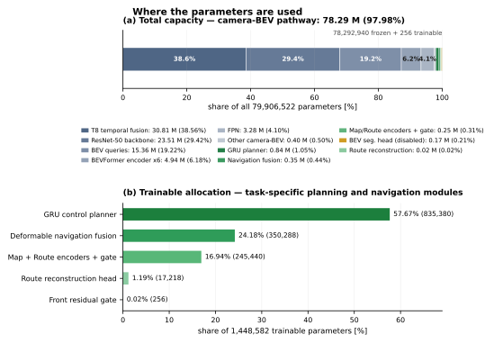
<figcaption>Parameter allocation of the evaluated six-view configuration. Panel (a) partitions all 79,906,522 parameters; the frozen camera-BEV pathway contains 78.29 M (97.98%). Panel (b) partitions the 1,448,582 trainable parameters among task-specific planning and navigation modules. The GRU planner contains 57.67% of trainable parameters, deformable navigation fusion 24.18%, and the Map/Route encoders plus route gate 16.94%.</figcaption>
</figure>

## Datasets and Evaluation Protocol

### Training Data and Provenance

All four trajectory checkpoints were trained with 8 distributed GPU workers, training seed 149, a frozen BEVFormer camera branch, trajectory weight 1.0, route-reconstruction weight 1.0, and BEV segmentation weight 0.0 (, ). The nuPlan  stage checkpoints (Epoch 4 and Epoch 5) use a learning rate of 1e-4 and an internal validation set of 1,024 samples. KITScenes  fine-tuning uses the frozen nuPlan Epoch 5 as its parent with a learning rate of 3e-5. The split manifest identifies the source as the official KITScenes training split: 129 empty scenes are excluded from 533 available train scenes, leaving 404 eligible scenes and 42,667 samples. A scene-level 90%/10% split yields 38,847 samples from 364 scenes for training and 3,820 samples from 40 scenes for frozen internal validation (BF16 validation precision). Because these 404 scenes belong to the official training split, their scene IDs are disjoint from the official 117-scene Val and 206-scene Test populations. KITScenes Epoch 5 was the best checkpoint retained at that point; Epoch 7 was not marked best. The selection score used by that registry flag is not documented in the evidence available to this paper. The registration metadata records eval_gate_pass = false for all four checkpoints, and this paper does not claim that a quality gate passed (Appendix A.3).

<figure class="table col-span-2" id="tab-config">
<figcaption>Training configuration and identifiers of the reported checkpoints. Only the leading 12 digits of the SHA-256 are shown.</figcaption>
<table class="small">
<thead><tr><th>Checkpoint</th><th>SHA-256 prefix</th><th>Training stage</th><th class="num">Learning rate</th><th>Parent</th><th class="num">Internal validation samples</th><th>Notes</th></tr></thead>
<tbody>
<tr><td>nuPlan Epoch 4</td><td>ed00e072471a</td><td>nuPlan trajectory and route (frozen camera BEV)</td><td class="num">1e-4</td><td>Official BEVFormer V2 R50 T8</td><td class="num">1,024</td><td>Registered as best on nuPlan</td></tr>
<tr><td>nuPlan Epoch 5</td><td>ca8b43d7a777</td><td>Same as above</td><td class="num">1e-4</td><td>Same as above</td><td class="num">1,024</td><td>Parent of KITScenes fine-tuning</td></tr>
<tr><td>KITScenes Epoch 5</td><td>120a21639d97</td><td>KITScenes fine-tuning</td><td class="num">3e-5</td><td>nuPlan Epoch 5 (frozen)</td><td class="num">3,820</td><td>Retained best</td></tr>
<tr><td>KITScenes Epoch 7</td><td>a1e6b1621018</td><td>KITScenes fine-tuning</td><td class="num">3e-5</td><td>nuPlan Epoch 5 (frozen)</td><td class="num">3,820</td><td>No best designation</td></tr>
</tbody>
</table>

Common to all: 8 GPU workers, seed 149, trajectory weight 1.0, route-reconstruction weight 1.0, BEV segmentation weight 0.0, eval_gate_pass = false.

</figure>

<figure class="fig col-span-2" id="fig-protocol">
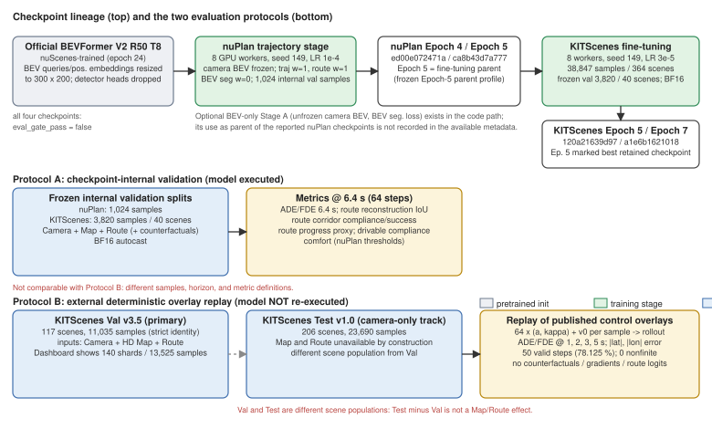
<figcaption>Top: checkpoint lineage. Starting from the official BEVFormer V2 R50 T8, the nuPlan trajectory stage (Epoch 4 / 5), then KITScenes fine-tuning with the frozen Epoch 5 as parent (Epoch 5 / 7). Bottom: the two evaluation protocols. Protocol A is checkpoint internal validation that runs the model (6.4 s); Protocol B is replay of the released deterministic control overlays (up to 5 s). The two are never mixed in a single ranking table. Val and Test are different scene populations.</figcaption>
</figure>

### Evaluation datasets

The primary evaluation is KITScenes Val v3.5 under a Camera + HD Map + oracle post-hoc Route input condition. The public dashboard displays 140 shard artifacts and 13,525 samples, whereas numerical evaluation uses the 117 official Val scenes and 11,035 samples satisfying the stricter Map/Route evaluation identity. The available report does not contain a per-reason breakdown for the 2,490 excluded samples; selection bias from this identity filter therefore cannot be ruled out. The map-valid and route-valid fractions of the 11,035-sample population were not retained in the replay report. The secondary evaluation is KITScenes Test v1.0 over all 206 scenes and 23,690 samples. Its manifests mark Map and Route unavailable; the loader supplies zero-valued rasters with validity gates false before the encoders. Because trained GroupNorm affine terms may respond to a zero tensor, this condition is more precisely an invalid-navigation-input condition than a structural removal of the navigation modules. The official KITScenes E2E protocol uses 200 nine-second windows from validation data, with 4 s of observation and up to 5 s of future trajectory . Our replay approximates its 40-history/50-future temporal contract but applies it to all samples admitted by the official Val/Test identity. Val and Test are different scene populations and are never treated as a paired ablation.

### Protocol A: checkpoint internal validation

The model is run with the same code as the training job to compute ADE/FDE at 6.4 s (64 steps), route-reconstruction IoU, and open-loop route, drivable-area, and comfort metrics. Route corridor compliance rate is the fraction of steps at which all four corners of the 4.8 m × 2.0 m ego footprint lie inside a 3.5 m wide route corridor, and success rate is the fraction of samples that comply at all 64 steps. Drivable-area compliance and success rates adopt the same definitions with respect to the drivable-area mask. The projected-endpoint arc-length proxy is the arc length obtained by projecting the predicted endpoint onto the logged trajectory polyline, and the ratio normalizes it by the logged trajectory length. For comfort, a sample is counted as a violation if it exceeds any of the nuPlan thresholds (longitudinal acceleration −4.05 to 2.40 m/s², lateral acceleration 4.89 m/s², yaw rate 0.95 rad/s, yaw acceleration 1.93 rad/s², longitudinal jerk 4.13 m/s³, jerk magnitude 8.37 m/s³), and the comfort rate is 1 − violation rate. Route metrics are computed on the 2,911 samples with a valid route.

### Protocol B: external deterministic overlay replay

The external evaluation replays the published control overlays for each checkpoint (64 acceleration/curvature pairs and an initial speed per sample) through Eq.  and compares the result with the logged trajectory; it does not re-run the model. Registry roles state that the Val overlays were generated by inference with Camera, HD Map and Route, and Test overlays under camera_only_missing_map_route. Replay reproduces the controls but cannot independently verify those inference inputs. ADE_h is the per-sample mean Euclidean error over valid steps through h seconds, then averaged across samples; FDE_h is the mean error at h seconds. Lateral and longitudinal errors average |Δy| and |Δx| over all valid 0–5 s steps and do not identify a horizon or mechanism. A sample is non-finite if any predicted control is non-finite. The replay artifacts contain no route counterfactual, input gradient, or route-reconstruction output. Under the benchmark window, 40 real egomotion steps (4.0 s) are left-zero-padded to the 64-step ABI and only 50 future steps (5.0 s) have valid targets. We therefore report 1, 2, 3 and 5 s metrics, not external 6.4 s metrics. By contrast, Protocol A uses the training-window construction with 64 real future targets; its 6.4 s KITScenes results are a different sample construction and are not ranked with Protocol B. No kinematic reference baseline or paired uncertainty interval is available in the completed replay report. Bold and underline in the tables denote numerical ordering only, not statistical significance.

## Results

### Primary evaluation: KITScenes Val (Camera + HD Map + Route)

 and  report ADE/FDE for the four checkpoints on 11,035 samples. KITScenes Epoch 7 has the lowest reported means at 1 s in ADE (0.1347 m) and FDE (0.2831 m), while KITScenes Epoch 5 has the lowest reported means at 2, 3 and 5 s for both ADE and FDE (5 s: ADE 1.9405 m, FDE 5.5645 m). The two nuPlan checkpoints are inferior to the KITScenes fine-tuned ones at every horizon, with 5 s FDE of 6.2–6.4 m.

<figure class="table col-span-2" id="tab-val-ade">
<figcaption>KITScenes Val v3.5, Camera + HD Map + Route, external overlay replay (n = 11,035 samples per model). Units m; lower is better. Bold marks the best and underline the second best within the same metric and horizon.</figcaption>
<table>
<thead><tr><th>Model</th><th class="num">ADE 1 s</th><th class="num">ADE 2 s</th><th class="num">ADE 3 s</th><th class="num">ADE 5 s</th><th class="num">FDE 1 s</th><th class="num">FDE 2 s</th><th class="num">FDE 3 s</th><th class="num">FDE 5 s</th></tr></thead>
<tbody>
<tr><td>KITScenes Epoch 5</td><td class="num second">0.1472</td><td class="num best">0.3729</td><td class="num best">0.7449</td><td class="num best">1.9405</td><td class="num second">0.2850</td><td class="num best">0.9239</td><td class="num best">2.0196</td><td class="num best">5.5645</td></tr>
<tr><td>KITScenes Epoch 7</td><td class="num best">0.1347</td><td class="num second">0.3886</td><td class="num second">0.8035</td><td class="num second">2.0952</td><td class="num best">0.2831</td><td class="num second">1.0101</td><td class="num second">2.2127</td><td class="num second">5.9509</td></tr>
<tr><td>nuPlan Epoch 5</td><td class="num">0.1951</td><td class="num">0.4723</td><td class="num">0.9147</td><td class="num">2.2951</td><td class="num">0.3779</td><td class="num">1.1331</td><td class="num">2.4226</td><td class="num">6.3885</td></tr>
<tr><td>nuPlan Epoch 4</td><td class="num">0.2030</td><td class="num">0.5018</td><td class="num">0.9503</td><td class="num">2.2919</td><td class="num">0.4066</td><td class="num">1.1935</td><td class="num">2.4508</td><td class="num">6.2272</td></tr>
</tbody>
</table>
</figure>

<figure class="fig col-span-2" id="fig-val">
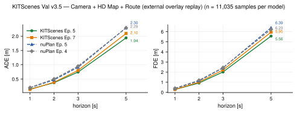
<figcaption>ADE (left) and FDE (right) across horizons on KITScenes Val v3.5 (Camera + HD Map + Route; n = 11,035). Solid lines are the KITScenes fine-tuned checkpoints, dashed lines the nuPlan-trained ones. The 5 s values are annotated.</figcaption>
</figure>

### Secondary evaluation: KITScenes Test (Camera only)

 and  report results on the camera-only track with 23,690 samples. KITScenes Epoch 5 has the lowest reported means at 1 s (ADE 0.1463 m, FDE 0.3107 m) and 5 s (ADE 2.1042 m, FDE 5.9422 m), whereas nuPlan Epoch 5 is lowest at 2 s and 3 s. KITScenes Epoch 7 has the largest errors at 2, 3 and 5 s; at 1 s, nuPlan Epoch 4 has the largest ADE and FDE. Because Val and Test have different scene populations, placing this table beside  does not measure the effect of map and route.

<figure class="table col-span-2" id="tab-test-ade">
<figcaption>KITScenes Test v1.0, Camera only (map and route unavailable by dataset construction), external overlay replay (n = 23,690 per model). Units m. Bold marks the best, underline the second best. This track is not a map ablation.</figcaption>
<table>
<thead><tr><th>Model</th><th class="num">ADE 1 s</th><th class="num">ADE 2 s</th><th class="num">ADE 3 s</th><th class="num">ADE 5 s</th><th class="num">FDE 1 s</th><th class="num">FDE 2 s</th><th class="num">FDE 3 s</th><th class="num">FDE 5 s</th></tr></thead>
<tbody>
<tr><td>KITScenes Epoch 5</td><td class="num best">0.1463</td><td class="num second">0.4121</td><td class="num second">0.8263</td><td class="num best">2.1042</td><td class="num best">0.3107</td><td class="num second">1.0453</td><td class="num second">2.2199</td><td class="num best">5.9422</td></tr>
<tr><td>KITScenes Epoch 7</td><td class="num">0.1680</td><td class="num">0.4923</td><td class="num">0.9831</td><td class="num">2.4699</td><td class="num">0.3754</td><td class="num">1.2512</td><td class="num">2.6242</td><td class="num">6.8964</td></tr>
<tr><td>nuPlan Epoch 5</td><td class="num second">0.1602</td><td class="num best">0.3979</td><td class="num best">0.7924</td><td class="num second">2.1120</td><td class="num second">0.3134</td><td class="num best">0.9727</td><td class="num best">2.1621</td><td class="num second">6.1751</td></tr>
<tr><td>nuPlan Epoch 4</td><td class="num">0.1916</td><td class="num">0.4817</td><td class="num">0.9181</td><td class="num">2.2840</td><td class="num">0.3899</td><td class="num">1.1514</td><td class="num">2.3895</td><td class="num">6.4266</td></tr>
</tbody>
</table>
</figure>

<figure class="fig col-span-2" id="fig-test">
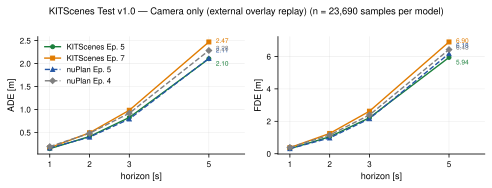
<figcaption>ADE and FDE on KITScenes Test v1.0 (Camera only; n = 23,690). This is a different scene population from Val, so differences with respect to  do not imply a causal effect of map and route.</figcaption>
</figure>

### Lateral and longitudinal error

 and  report the mean absolute lateral error (|Δy|) and longitudinal error (|Δx|) over all valid steps. On Val, KITScenes Epoch 5 is smallest in both (0.9844 m, 1.4025 m). On Test, nuPlan Epoch 5 is smallest laterally (1.0584 m) and KITScenes Epoch 5 longitudinally (1.4051 m). For every model, mean longitudinal error exceeds mean lateral error over all valid 0–5 s steps. This aggregate does not identify a horizon or a causal mechanism, and the scene population has much greater along-track than cross-track displacement.

<figure class="table col-span-2" id="tab-latlon">
<figcaption>Mean absolute lateral and longitudinal errors over valid steps (units m, external overlay replay). Val: n = 11,035; Test: n = 23,690. Bold marks the best and underline the second best within the same dataset and metric.</figcaption>
<table>
<thead><tr><th rowspan="2">Model</th><th class="num" colspan="2">KITScenes Val v3.5 (Camera + Map + Route)</th><th class="num" colspan="2">KITScenes Test v1.0 (Camera only)</th></tr>
<tr><th class="num">Lateral |Δy|</th><th class="num">Longitudinal |Δx|</th><th class="num">Lateral |Δy|</th><th class="num">Longitudinal |Δx|</th></tr></thead>
<tbody>
<tr><td>KITScenes Epoch 5</td><td class="num best">0.9844</td><td class="num best">1.4025</td><td class="num second">1.2044</td><td class="num best">1.4051</td></tr>
<tr><td>KITScenes Epoch 7</td><td class="num second">1.0220</td><td class="num second">1.5659</td><td class="num">1.4730</td><td class="num">1.6598</td></tr>
<tr><td>nuPlan Epoch 5</td><td class="num">1.1911</td><td class="num">1.6633</td><td class="num best">1.0584</td><td class="num second">1.5496</td></tr>
<tr><td>nuPlan Epoch 4</td><td class="num">1.2082</td><td class="num">1.6448</td><td class="num">1.2167</td><td class="num">1.6287</td></tr>
</tbody>
</table>
</figure>

<figure class="fig col-span-2" id="fig-latlon">
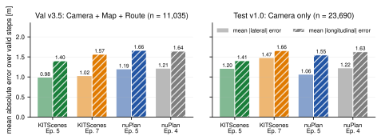
<figcaption>Mean absolute lateral error (light) and longitudinal error (hatched). Left: Val (Camera + Map + Route); right: Test (Camera only). The two panels are evaluations on different populations.</figcaption>
</figure>

### Checkpoint internal validation

 reports the internal validation protocol and is treated as a ranking table separate from the external replay. On nuPlan internal validation (1,024 samples) the nuPlan checkpoints reach ADE of about 1.26 m and FDE of about 3.85–3.90 m at 6.4 s, whereas on the KITScenes frozen validation (3,820 samples) the KITScenes checkpoints reach ADE 2.63–2.75 m and FDE 7.56–7.86 m. Since these are numbers on different datasets, the nuPlan and KITScenes rows are likewise not compared with each other. Route-reconstruction IoU is above 0.99 in all cases, but because the reconstruction head receives route-derived features, this metric mainly verifies that route information is preserved in the representation and does not mean that the vehicle drove along the route.

<figure class="table" id="tab-internal">
<figcaption>Checkpoint internal validation (Protocol A, 6.4 s, 64 steps). The nuPlan rows are nuPlan internal validation and the KITScenes rows are KITScenes frozen validation; comparisons across rows are restricted to within the same dataset.</figcaption>
<table>
<thead><tr><th>Model</th><th class="num">n</th><th class="num">ADE 6.4 s</th><th class="num">FDE 6.4 s</th><th class="num">Route reconstruction IoU</th></tr></thead>
<tbody>
<tr><td>nuPlan Epoch 4</td><td class="num">1,024</td><td class="num best">1.2578</td><td class="num best">3.8450</td><td class="num">0.9912</td></tr>
<tr><td>nuPlan Epoch 5</td><td class="num">1,024</td><td class="num">1.2668</td><td class="num">3.8982</td><td class="num best">0.9980</td></tr>
<tr class="group"><td>KITScenes Epoch 5</td><td class="num">3,820</td><td class="num best">2.6326</td><td class="num best">7.5567</td><td class="num best">0.9991</td></tr>
<tr><td>KITScenes Epoch 7</td><td class="num">3,820</td><td class="num">2.7548</td><td class="num">7.8574</td><td class="num">0.9990</td></tr>
</tbody>
</table>
</figure>

For the two KITScenes checkpoints,  and  report the open-loop route, drivable-area, and comfort metrics. Epoch 7 increases route corridor compliance rate (0.3959 → 0.4236), route corridor success rate (0.0608 → 0.0763), the projected-endpoint arc-length proxy (44.7857 → 45.5856 m; ratio 0.8725 → 0.8982), and increases drivable-area compliance rate (0.7758 → 0.7988), while degrading drivable-area success rate (0.4442 → 0.4139) and comfort rate (0.7542 → 0.7466), and also degrading ADE/FDE at 6.4 s. In the breakdown of comfort violations (Appendix A.4), jerk magnitude and yaw acceleration violations account for the majority, while longitudinal and lateral acceleration and yaw rate violations are below 2%.

<figure class="table" id="tab-internal-kit">
<figcaption>Open-loop metrics on the KITScenes frozen internal validation (n = 3,820; route metrics on the 2,911 samples with a valid route). ↑ higher is better, ↓ lower is better.</figcaption>
<table>
<thead><tr><th>Metric</th><th class="num">Epoch 5</th><th class="num">Epoch 7</th></tr></thead>
<tbody>
<tr><td>Route corridor compliance rate ↑</td><td class="num">0.3959</td><td class="num best">0.4236</td></tr>
<tr><td>Route corridor success rate ↑</td><td class="num">0.0608</td><td class="num best">0.0763</td></tr>
<tr><td>Route progress proxy [m] ↑</td><td class="num">44.7857</td><td class="num best">45.5856</td></tr>
<tr><td>Route progress proxy ratio ↑</td><td class="num">0.8725</td><td class="num best">0.8982</td></tr>
<tr><td>Drivable-area compliance rate ↑</td><td class="num">0.7758</td><td class="num best">0.7988</td></tr>
<tr><td>Drivable-area success rate ↑</td><td class="num best">0.4442</td><td class="num">0.4139</td></tr>
<tr><td>Comfort rate ↑</td><td class="num best">0.7542</td><td class="num">0.7466</td></tr>
<tr><td>Comfort violation rate ↓</td><td class="num best">0.2458</td><td class="num">0.2534</td></tr>
<tr class="group"><td>ADE 6.4 s [m] ↓</td><td class="num best">2.6326</td><td class="num">2.7548</td></tr>
<tr><td>FDE 6.4 s [m] ↓</td><td class="num best">7.5567</td><td class="num">7.8574</td></tr>
</tbody>
</table>
</figure>

<figure class="fig col-span-2" id="fig-tradeoff">
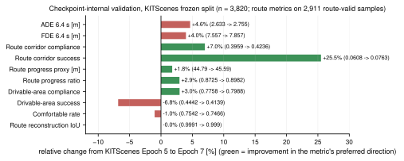
<figcaption>Relative change from KITScenes Epoch 5 to Epoch 7 (internal validation). Green denotes change in the desirable direction for each metric, red change in the undesirable direction. The route proxies improve, while long-horizon trajectory error, drivable-area success rate, and comfort rate degrade.</figcaption>
</figure>

### Numerical integrity and coverage

 reports the coverage of the external replay. On Val, 551,750 of 11,035 samples × 64 steps = 706,240 steps are valid; on Test, 1,184,500 of 23,690 × 64 = 1,516,160, giving a coverage of 78.125% (50/64) in both cases. Non-finite predictions were 0 in all eight external evaluations.

<figure class="table" id="tab-integrity">
<figcaption>Evaluation integrity of the external overlay replay (common to the four models).</figcaption>
<table>
<thead><tr><th>Dataset</th><th class="num">Samples / model</th><th class="num">Valid steps</th><th class="num">Total steps</th><th class="num">Coverage</th><th class="num">Non-finite predictions</th></tr></thead>
<tbody>
<tr><td>KITScenes Val v3.5</td><td class="num">11,035</td><td class="num">551,750</td><td class="num">706,240</td><td class="num">78.125%</td><td class="num">0</td></tr>
<tr><td>KITScenes Test v1.0</td><td class="num">23,690</td><td class="num">1,184,500</td><td class="num">1,516,160</td><td class="num">78.125%</td><td class="num">0</td></tr>
</tbody>
</table>
</figure>

### Qualitative results

 shows six examples in which the released control overlays are replayed on each sample's own map and route raster. Selection followed a fixed rule: sort the shard artifacts by name, scan the sample at the median index of the first 30 shards, and take (a) the example with the smallest and (b) the largest 5 s FDE for Epoch 5, (c) the first left turn, (d) the first right turn, (e) the first straight approach to an intersection, and (f) the first straight segment without an intersection (Appendix A.5). No post hoc screening by error was performed outside this rule. In example (a), Epoch 5 follows the right turn with an FDE of 0.47 m while Epoch 7 deviates by 5.29 m; in the roundabout of example (d), Epoch 7 (3.90 m) outperforms Epoch 5 (6.50 m). In example (b), all four models travel farther than the logged trajectory (FDE 9.9–18.5 m), failing to predict the deceleration. These are single-sample observations, not statistical conclusions.

<figure class="fig col-span-2" id="fig-qual">
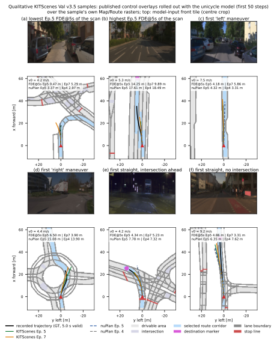
<figcaption>Qualitative examples from KITScenes Val v3.5. The top row shows the model-input front tile of each sample (center crop); the bottom row shows the logged trajectory (black, 5 s) and the replayed trajectories of the four checkpoints (first 50 steps) on the map and route raster. The 5 s FDE is annotated in each panel. The selection rule follows the main text and Appendix A.5 and involves no post hoc screening by error.</figcaption>
</figure>

## Discussion

### Epoch 5 versus Epoch 7

In Protocol B, continuing training from Epoch 5 to Epoch 7 reduced 1 s error (ADE 0.1472 → 0.1347 m) and degraded accuracy at 2 s and beyond (5 s ADE 1.9405 → 2.0952 m, FDE 5.5645 → 5.9509 m). In Protocol A, the same additional training increased route-corridor compliance and the censored projected-endpoint arc-length proxy while increasing 6.4 s error and lowering comfort. These are direct observations from different protocols and sample populations, not a joint ranking. For this checkpoint pair, selecting by one trajectory or route metric would regress another reported metric. Checkpoint selection should therefore be multi-objective: The registry marks Epoch 5 as best by an undocumented selection score; Epoch 7 nevertheless has a lower 1 s mean in Protocol B and a larger censored projected-endpoint arc-length proxy in Protocol A. No statistical distinction is claimed.

### Cross-dataset transfer

On the same KITScenes Val scenes, KITScenes fine-tuning outperformed the nuPlan-trained checkpoints at every horizon (RQ2). The gap between nuPlan Epoch 4 and Epoch 5 is small, and at 5 s FDE Epoch 4 is slightly better. On the camera-only Test split the ranking changes: nuPlan Epoch 5 has the lowest reported mean at 2 s and 3 s, whereas KITScenes Epoch 7 is largest within the Test table at 2, 3 and 5 s. KITScenes fine-tuning was trained under a condition in which the map and the route are provided, so it is conceivable that it becomes relatively brittle when they are absent; however, because Test and Val contain different scenes, geographies, motion distributions, and goal identities, this gap cannot be quantified as the effect of missing map and route inputs (RQ3).

### Route provenance and route reconstruction

The KITScenes route is a lane sequence obtained by fitting the driven trajectory of the entire scene to Lanelet2, with the destination set to the end of the scene (). This route is equivalent to the lane-level intent the driver actually chose, and it can be more informative than a route supplied by a navigation system at deployment time. The numbers in the primary evaluation should therefore be read as performance under an oracle route reconstructed from the logged future trajectory, and they do not cover robustness to route errors or route replanning. A route-reconstruction IoU of 0.999 verifies that the reconstruction head can recover the route raster from the post-gate route contribution, i.e. that the gate does not collapse the route information; it is not evidence that the policy drove along the route. Behavioral route adherence is measured by the route-corridor compliance and success rates, and those values (compliance 0.40–0.42, success 0.06–0.08) are low under the strict definition that a 2.0 m wide footprint must remain inside a 3.5 m wide corridor at every step.

### What can be claimed about the effect of the map and the route

The evidence in this paper does not support the claim that the HD map and the route causally improved planning accuracy (RQ5). There are five reasons. Val and Test are different scenes. Test, by dataset construction, has no map and no route. The current report contains no camera-only baseline on the same scenes as Val. The external overlay replay does not retain the counterfactual route input. Per-scene paired errors and bootstrap confidence intervals have not yet been computed.

We instead offer the following design hypotheses. The HD map should reduce geometric ambiguity in lane topology, intersections, stop lines, and drivable boundaries. The route should uniquely determine which of several topologically valid branches the ego vehicle takes. Encoding the map and the route separately should prevent the sparse chosen route from being buried in the dense static map features. Residual, gated fusion should add navigation information without destroying the pretrained visual BEV representation. These remain hypotheses until controlled experiments are available.

### Relation to UniAD

UniAD and AutoE2E both adopt a BEV-centric representation and planning-oriented feature sharing. UniAD unifies perception, tracking, mapping, motion forecasting, occupancy, and planning through task interaction, whereas AutoE2E narrows its scope to temporal camera BEV, explicit navigation context, auxiliary route reconstruction, and direct ego planning, and treats externally supplied HD maps and routes as first-class deployment inputs. The claim of this paper is that evaluation inputs should match the contract of the deployed policy; we make no claim of superiority or inferiority relative to UniAD, since no common benchmark exists. We also do not compare against the zero-shot UniAD numbers reported in the KITScenes paper (200 samples, 3 s), because the sample set, horizon, and input conditions differ.

## Limitations

The evaluation in this paper is open-loop only and includes no closed-loop safety or intervention metrics. No controlled map/route experiment on identical scenes was conducted. The external replay is limited to 5 s, so 22% of the 6.4 s output is not evaluated. Val and Test are different populations, and the difference between them carries no causal meaning. The camera encoder is frozen, and the degree to which a representation trained on nuScenes fits the 6-camera configuration and 0.6 m grid of KITScenes has not been separately evaluated (the BEV segmentation head is disabled, and occupancy IoU is not computed). The full UniAD task stack is not included. Confidence intervals are omitted because per-scene data have not been aggregated. All checkpoint quality gates are recorded as not passed, and the details of the gate definitions are not part of the evidence in this paper (Appendix A.3). The training data are nuPlan and KITScenes from three German cities, so distribution shifts in geography, season, and map may exist. Because the route is a post-hoc sequence of already-driven lanes, robustness to route errors is not measured. Under the KITScenes benchmark protocol, only 4.0 s of the 6.4 s ego motion history is real data, leaving a distribution gap with respect to training (6.4 s). The six qualitative examples and the occupancy rates in  are descriptive observations from a scan of 30 samples, not population statistics.

## Conclusion

AutoE2E couples separately encoded HD map and oracle post-hoc route rasters into a frozen temporal camera BEV via a gated residual and generates controls with a GRU. We evaluated it at scale under matching camera/map/route modalities, but with 4.0 s of real egomotion history padded to 6.4 s and only a 5.0 s evaluated output horizon. Under the Camera + HD Map + Route KITScenes Val protocol, KITScenes Epoch 5 has the lowest reported Protocol-B means at 2, 3 and 5 s, while Epoch 7 has the lowest 1 s mean. Separately, Protocol A shows a larger censored projected-endpoint arc-length proxy for Epoch 7 together with larger 6.4 s error and lower aggregate comfort. The camera-only Test split is useful for robustness analysis, but because it contains different scenes it cannot quantify the causal contribution of the navigation inputs. That claim requires paired Camera / Camera + Map / Camera + Map + Route evaluation on identical scenes, and this paper specifies that protocol in the appendix. Deployment-aligned evaluation should retain the navigation inputs the policy requires, and camera-only evaluation should be positioned as a complementary robustness track.

## Acknowledgments{.acknowledgement}

We thank the contributors and the community of the Autoware Foundation Robotaxi Working Group.

## References{.reference}

Y. Hu, J. Yang, L. Chen, K. Li, C. Sima, X. Zhu, S. Chai, S. Du, T. Lin, W. Wang, L. Lu, X. Jia, Q. Liu, J. Dai, Y. Qiao, and H. Li. Planning-Oriented Autonomous Driving. In <i>Proc. IEEE/CVF CVPR</i>, pp. 17853–17862, 2023. arXiv:2212.10156.

Z. Li, W. Wang, H. Li, E. Xie, C. Sima, T. Lu, Y. Qiao, and J. Dai. BEVFormer: Learning Bird's-Eye-View Representation from Multi-camera Images via Spatiotemporal Transformers. In <i>Computer Vision – ECCV 2022</i>, LNCS 13669, pp. 1–18, Springer, 2022. doi:10.1007/978-3-031-20077-9_1.

C. Yang, Y. Chen, H. Tian, C. Tao, X. Zhu, Z. Zhang, G. Huang, H. Li, Y. Qiao, L. Lu, J. Zhou, and J. Dai. BEVFormer v2: Adapting Modern Image Backbones to Bird's-Eye-View Recognition via Perspective Supervision. In <i>Proc. IEEE/CVF CVPR</i>, pp. 17830–17839, 2023. arXiv:2211.10439.

X. Zhu, W. Su, L. Lu, B. Li, X. Wang, and J. Dai. Deformable DETR: Deformable Transformers for End-to-End Object Detection. In <i>Proc. ICLR</i>, 2021. arXiv:2010.04159.

B. Jiang, S. Chen, Q. Xu, B. Liao, J. Chen, H. Zhou, Q. Zhang, W. Liu, C. Huang, and X. Wang. VAD: Vectorized Scene Representation for Efficient Autonomous Driving. In <i>Proc. IEEE/CVF ICCV</i>, pp. 8340–8350, 2023. arXiv:2303.12077.

K. Chitta, A. Prakash, B. Jaeger, Z. Yu, K. Renz, and A. Geiger. TransFuser: Imitation with Transformer-Based Sensor Fusion for Autonomous Driving. <i>IEEE Trans. Pattern Analysis and Machine Intelligence</i>, 45(11):12878–12895, 2023. doi:10.1109/TPAMI.2022.3200245.

A. Prakash, K. Chitta, and A. Geiger. Multi-Modal Fusion Transformer for End-to-End Autonomous Driving. In <i>Proc. IEEE/CVF CVPR</i>, pp. 7077–7087, 2021. arXiv:2104.09224.

H. Caesar, J. Kabzan, K. S. Tan, W. K. Fong, E. Wolff, A. Lang, L. Fletcher, O. Beijbom, and S. Omari. nuPlan: A closed-loop ML-based planning benchmark for autonomous vehicles. <i>CVPR 2021 Workshop on Autonomous Driving: Perception, Prediction and Planning (ADP3)</i>, 2021. arXiv:2106.11810.

H. Caesar, V. Bankiti, A. H. Lang, S. Vora, V. E. Liong, Q. Xu, A. Krishnan, Y. Pan, G. Baldan, and O. Beijbom. nuScenes: A Multimodal Dataset for Autonomous Driving. In <i>Proc. IEEE/CVF CVPR</i>, pp. 11621–11631, 2020.

R. Schwarzkopf, F. Immel, A. Blumberg, J. Merkert, N. Rack, K. Wang, F. Konstantinidis, J. Truetsch, C. Fernandez, A. Bätz, K. Rösch, M. Steiner, W. Poh, Y. Shen, R. Wagner, F. Hauser, D. Strutz, J. Villa, G. Stepanov, H. Caesar, Ö. Ş. Taş, F. Bieder, J.-H. Pauls, and C. Stiller. The Road Ahead in Autonomous Driving: The KITScenes Multimodal Dataset. arXiv:2606.02956, 2026.

F. Poggenhans, J.-H. Pauls, J. Janosovits, S. Orf, M. Naumann, F. Kuhnt, and M. Mayr. Lanelet2: A High-Definition Map Framework for the Future of Automated Driving. In <i>Proc. 21st IEEE ITSC</i>, pp. 1672–1679, 2018. doi:10.1109/ITSC.2018.8569929.

M. Bansal, A. Krizhevsky, and A. Ogale. ChauffeurNet: Learning to Drive by Imitating the Best and Synthesizing the Worst. In <i>Proc. Robotics: Science and Systems (RSS)</i>, 2019. doi:10.15607/RSS.2019.XV.031.

J. Gao, C. Sun, H. Zhao, Y. Shen, D. Anguelov, C. Li, and C. Schmid. VectorNet: Encoding HD Maps and Agent Dynamics From Vectorized Representation. In <i>Proc. IEEE/CVF CVPR</i>, pp. 11525–11533, 2020.

M. Liang, B. Yang, R. Hu, Y. Chen, R. Liao, S. Feng, and R. Urtasun. Learning Lane Graph Representations for Motion Forecasting. In <i>Computer Vision – ECCV 2020</i>, LNCS 12347, pp. 541–556, Springer, 2020. doi:10.1007/978-3-030-58536-5_32.

J.-T. Zhai, Z. Feng, J. Du, Y. Mao, J.-J. Liu, Z. Tan, Y. Zhang, X. Ye, and J. Wang. Rethinking the Open-Loop Evaluation of End-to-End Autonomous Driving in nuScenes. arXiv:2305.10430, 2023.

Z. Li, Z. Yu, S. Lan, J. Li, J. Kautz, T. Lu, and J. M. Alvarez. Is Ego Status All You Need for Open-Loop End-to-End Autonomous Driving? In <i>Proc. IEEE/CVF CVPR</i>, pp. 14864–14873, 2024. arXiv:2312.03031.

D. Dauner, M. Hallgarten, A. Geiger, and K. Chitta. Parting with Misconceptions about Learning-based Vehicle Motion Planning. In <i>Proc. 7th Conference on Robot Learning (CoRL)</i>, PMLR 229, pp. 1268–1281, 2023.

D. Dauner, M. Hallgarten, T. Li, X. Weng, Z. Huang, Z. Yang, H. Li, I. Gilitschenski, B. Ivanovic, M. Pavone, A. Geiger, and K. Chitta. NAVSIM: Data-Driven Non-Reactive Autonomous Vehicle Simulation and Benchmarking. In <i>Advances in Neural Information Processing Systems 37 (NeurIPS 2024), Datasets and Benchmarks Track</i>, 2024. arXiv:2406.15349.

B. Jaeger, K. Chitta, and A. Geiger. Hidden Biases of End-to-End Driving Models. In <i>Proc. IEEE/CVF ICCV</i>, pp. 8240–8249, 2023. arXiv:2306.07957.

K. He, X. Zhang, S. Ren, and J. Sun. Deep Residual Learning for Image Recognition. In <i>Proc. IEEE CVPR</i>, pp. 770–778, 2016.

## Appendix{.appendix}

### Reproducibility

The evaluated model configuration identifier is bevformer_v2_t8_split_navigation_v5. The camera pathway is initialized from the official BEVFormer V2 R50 T8 checkpoint (SHA-256 prefix 5585bc4d3ff8; weight license NOASSERTION; trained on nuScenes under CC-BY-NC-SA-4.0), loaded with the BEV queries and the row/column positional embeddings resized to 300×200, the camera embeddings matched to the number of views, and the detection and perspective heads omitted. The parameter counts reported here were obtained by instantiating this configuration with 6 views (). The version identifiers of the rasterizer, evaluator, and integrator are navigation_rasterizer_v1, reactive_open_loop_metrics_v1, and semi_implicit_unicycle_v1. KITScenes originates from KIT-MRT/KITScenes-Multimodal on Hugging Face (data revision 6fde0034…, SDK revision 7765cdec…). The content-hash prefixes of the external evaluation index and of the Val and Test manifests are be1cec5f77a7, 4a12ede73949, and b5dbe72c8d2c. Each internal-validation evaluation report is recorded with its hash in the model registry, and we verified that the internal-validation numbers reported here match the records in the public experiment registry.

### Evaluation identifiers

The external evaluations are KITScenes Val v3.5 (role official_val_camera_map_route, input track camera_map_route, 117 scenes, 11,035 samples) and KITScenes Test v1.0 (role official_test_camera_only_missing_map_route, input track camera_only_missing_map_route, 206 scenes, 23,690 samples). The inference precision policy is CUDA BF16 automatic mixed precision. The live Val evaluation policy declares a route-zero pass using a reused precomputed image BEV, and the publication code requires aggregate route_zero_sample_count and route_zero_trajectory_delta_m values. This indicates that an aggregate route-zero pass was executed upstream. However, per-sample counterfactual controls and errors are absent from the external replay artifacts, and the aggregate delta was not included in the result packet available to this paper. It is therefore neither reported nor treated as the requested three-condition A/B/C ablation with per-scene deltas and confidence intervals. Test marks the policy not applicable. The internal-validation protocols are reactive_trajectory_route_validation_6p4s_v1 (nuPlan) and kitscenes_internal_trajectory_route_validation_6p4s_v1 (KITScenes).

### Quality gates

The eval_gate_pass field in the registry metadata is false for all four checkpoints. The repository's legacy evaluation workflow contains a gate defined as "6.4 s ADE < 2.0 m and FDE < 4.0 m," but our evidence does not confirm that the registry field was computed under this definition. We therefore do not speculate about why the gate was not passed and report only the recorded values.

### Breakdown of comfort violations

<figure class="table" id="tab-comfort">
<figcaption>Breakdown of comfort-violation rates on the frozen KITScenes internal validation set (n = 3,820), as recorded in the public experiment registry. Violations are counted per sample whenever any component exceeds its nuPlan threshold.</figcaption>
<table>
<thead><tr><th>Component</th><th class="num">Threshold</th><th class="num">Epoch 5</th><th class="num">Epoch 7</th></tr></thead>
<tbody>
<tr><td>Longitudinal acceleration</td><td class="num">−4.05 / 2.40 m/s²</td><td class="num">0.0042</td><td class="num">0.0034</td></tr>
<tr><td>Lateral acceleration (v²κ)</td><td class="num">4.89 m/s²</td><td class="num">0.0147</td><td class="num">0.0126</td></tr>
<tr><td>Yaw rate (vκ)</td><td class="num">0.95 rad/s</td><td class="num">0.0089</td><td class="num">0.0079</td></tr>
<tr><td>Yaw acceleration</td><td class="num">1.93 rad/s²</td><td class="num">0.1579</td><td class="num">0.1401</td></tr>
<tr><td>Longitudinal jerk</td><td class="num">4.13 m/s³</td><td class="num">0.0000</td><td class="num">0.0000</td></tr>
<tr><td>Jerk magnitude</td><td class="num">8.37 m/s³</td><td class="num">0.2356</td><td class="num">0.2442</td></tr>
<tr class="group"><td>Any violation</td><td class="num">—</td><td class="num">0.2458</td><td class="num">0.2534</td></tr>
</tbody>
</table>
</figure>

### Selection rule for the qualitative figures and occupancy statistics

We sorted the 140 shard artifacts of KITScenes Val v3.5 listed by the public dashboard in lexicographic order by name and, for the first 30 shards, retrieved one sample each at the median index position (the integer part of half the number of elements). For every sample we retrieved the map and route rasters, the recorded trajectory, the navigation metadata, the front-camera tile, and the public control overlays of the four checkpoints (schema v5, one seed), and rolled them out with Eq. . The 30 samples comprise 22 straight, 4 right-turn, 2 left-turn, and 2 unknown maneuvers; 28 with a valid route, 30 with a valid map, 26 with a visible goal, and 50 valid future steps in every case.  shows the sample with the largest number of non-empty channels, and the six examples in  were chosen by the rule stated in the main text, with no additional selection by error. Across the sweep, the Epoch 5 5 s FDE ranged from 0.47 to 14.25 m. These 30 samples were not designed to be a representative sample of the population.

### Note on raster geometry

The public navigation geometry audited in KITScenes v3 is 256×256 cells at 1.0 m/px (X: −85.5 to 170.5 m, Y: −128 to 128 m) and covers 99.79% of the 6.4 s endpoints. The rasters actually received by the evaluated checkpoints from KITScenes Val v3.5, in contrast, are 450×300 cells at 0.4 m/px (X: −60 to 120 m, Y: −60 to 60 m), which we confirmed from the navigation metadata of the public dataset artifacts (geometry_id = autoe2e-bev-450x300-0p4m-v1) and from the array shapes (14×450×300 and 2×450×300). The navigation encoder bilinearly resamples these onto a 300×200 latent grid, so their extent matches that of the camera BEV. BEV segmentation evaluation nearest-neighbor-resamples the 1.0 m geometry labels onto the 0.4 m grid, but we do not report BEV segmentation numbers in this paper.

### Claim audit

<figure class="table col-span-2" id="tab-claims">
<figcaption>Principal claims and the type of evidence supporting each. Types: implementation = source code and instantiation; registry = checkpoint registry metadata and the public experiment registry; measured = numbers from completed evaluations; interpretation = a reading supported by the measurements; hypothesis = not yet tested.</figcaption>
<table class="small">
<thead><tr><th>Claim</th><th>Type</th><th>Evidence</th></tr></thead>
<tbody>
<tr><td>The camera pathway is based on the official BEVFormer V2 R50 T8 and is frozen during the trajectory-training stage</td><td>Implementation, registry</td><td>Initialization code and freeze contract; training configuration freeze_bevformer = true</td></tr>
<tr><td>BEV grid 300×200, X −60 to 120 m, Y −60 to 60 m, 0.6 m cells</td><td>Implementation</td><td>Fixed model configuration; confirmed by instantiation</td></tr>
<tr><td>7 history frames plus the current frame, 0.5 s spacing, 3.5 s; history at 512 px only</td><td>Implementation</td><td>T8 contract constants and history-encoding code</td></tr>
<tr><td>The 1024 px front branch is added for the current frame only; the 512 px front view remains in the all-view encoder</td><td>Implementation</td><td>Front residual-branch code; zero-init gate</td></tr>
<tr><td>Map 14 ch, route 2 ch, corridor 3.5 m, goal radius 2.0 m</td><td>Implementation</td><td>Channel enumeration and rasterizer; array shapes from real data</td></tr>
<tr><td>The evaluated map and route rasters are 450×300 at 0.4 m/px</td><td>Registry, implementation</td><td>geometry_id and array shapes of Val v3.5 samples; data-contract validation code</td></tr>
<tr><td>Deformable fusion uses 8 points, 8 heads, 256 ch, and is identity at initialization</td><td>Implementation</td><td>zero-init of the fusion module</td></tr>
<tr><td>GRU planner, 16 sample points, 64 steps, acceleration and curvature outputs</td><td>Implementation</td><td>Planner configuration num_points = 16</td></tr>
<tr><td>79,906,522 parameters in total, 1,448,582 trainable</td><td>Implementation</td><td>Parameter count from our instantiation; consistent with the repository record of 79,907,034 (8 views)</td></tr>
<tr><td>enable_world_model = false, temporal_memory_mode = no_memory; h_vis is zero</td><td>Implementation, registry</td><td>Fixed configuration; KITScenes sample-generation code</td></tr>
<tr><td>Training configuration of the four checkpoints (8 workers, seed 149, weights 1.0/1.0/0.0, LR)</td><td>Registry</td><td>Checkpoint registry metadata; learning-rate records in the public experiment registry</td></tr>
<tr><td>eval_gate_pass = false (all four checkpoints)</td><td>Registry</td><td>Registry metadata; gate definition unconfirmed</td></tr>
<tr><td>On Val, Epoch 7 is best at 1 s, while Epoch 5 is best at 2/3/5 s and on lateral and longitudinal error</td><td>Measured</td><td>, </td></tr>
<tr><td>On Test, Epoch 5 is best at 1 s and 5 s; on nuPlan, Epoch 5 is best at 2 s and 3 s</td><td>Measured</td><td></td></tr>
<tr><td>Zero non-finite predictions, 78.125% coverage</td><td>Measured</td><td></td></tr>
<tr><td>Epoch 7 improves the route-related proxies while degrading 6.4 s error, drivable-area success rate, and comfort rate</td><td>Measured</td><td>; matches the values in the public experiment registry</td></tr>
<tr><td>Additional training improves near-horizon accuracy and degrades mid- and long-horizon accuracy</td><td>Interpretation</td><td>Rank inversion between 1 s and 2–5 s on Val</td></tr>
<tr><td>Checkpoint selection should be multi-objective</td><td>Interpretation</td><td>Cross-metric trade-off between Epoch 5 and Epoch 7</td></tr>
<tr><td>Route-reconstruction IoU verifies information preservation, not route adherence</td><td>Interpretation</td><td>The head takes the post-gate route contribution as input; divergence from the adherence rate</td></tr>
<tr><td>The Test results do not show that the map is unnecessary</td><td>Interpretation</td><td>Difference between the Val and Test scene populations</td></tr>
<tr><td>HD map and route should resolve geometric ambiguity and branching</td><td>Hypothesis</td><td>Controlled experiment not run</td></tr>
<tr><td>Benefits of separate encoding and residual gated fusion</td><td>Hypothesis</td><td>Controlled experiment not run</td></tr>
<tr><td>Map and route causally improved planning accuracy</td><td>Not claimed</td><td>No same-scene control; counterfactuals not stored; confidence intervals not computed</td></tr>
</tbody>
</table>
</figure>

### Additional experiments required for causal claims

<figure class="fig col-span-2" id="fig-ablation">
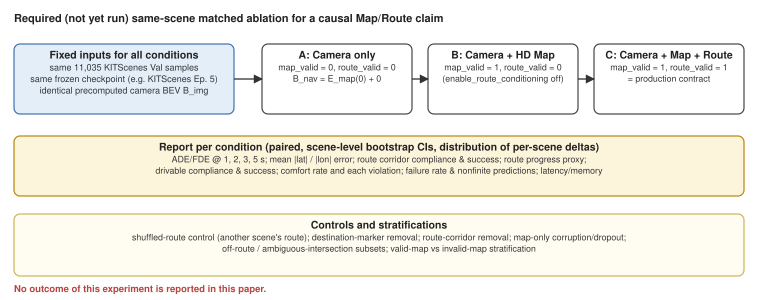
<figcaption>Design of the same-scene controlled experiment required to establish the effect of map and route. On the same 11,035 KITScenes Val samples and the same frozen checkpoint, the same precomputed camera BEV features are reused while only the navigation input is switched among A (camera only), B (camera + HD map), and C (camera + HD map + route). We do not have results for this experiment.</figcaption>
</figure>

The same 11,035 KITScenes Val samples and the same frozen checkpoint would be evaluated in matched fashion under three conditions: A, camera only; B, camera + HD map; C, camera + HD map + route. The same precomputed camera BEV features are reused across the three conditions, and only the navigation input is changed. Switching uses the explicit map_valid, route_valid, and enable_route_conditioning gates; stochastic augmentation is not re-run, and the planner configuration is held fixed. The reported quantities are ADE/FDE at 1, 2, 3, and 5 s; mean absolute lateral and longitudinal error; route-corridor adherence and success rates; the projected-endpoint arc-length proxy; drivable-area adherence and success rates; the comfort rate and each violation component; the failure rate and non-finite predictions; and, where possible, inference latency and memory. Scene-level paired bootstrap confidence intervals and the distribution of per-scene differences would be reported. Additional controls would include a shuffled route taken from a different scene, removal of the goal marker, removal of the route corridor, map-only corruption and dropout, off-route and ambiguous-intersection subsets, and stratification by valid versus invalid map. These results are not included in this paper, and we do not predict them.
