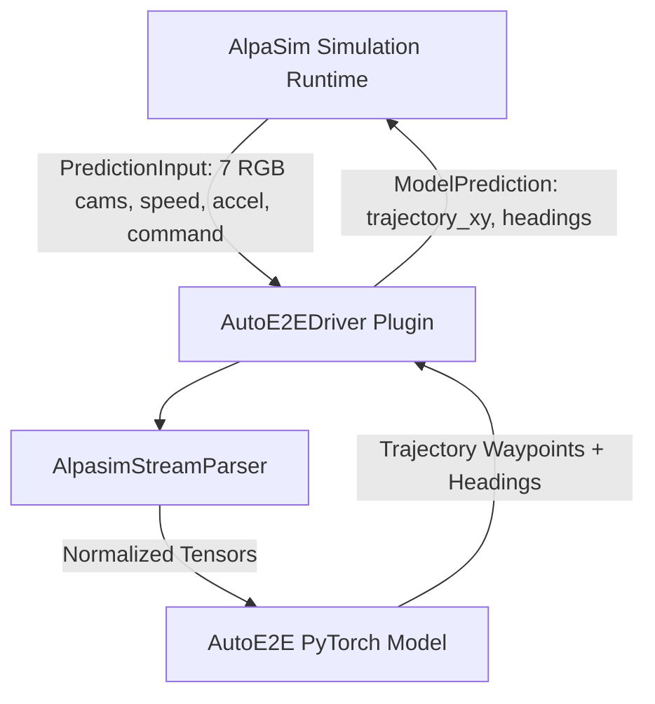

# AutoE2E AlpaSim Driver Plugin

This package provides the official **AutoE2E driver plugin** for [NVIDIA AlpaSim](https://github.com/NVlabs/alpasim), enabling real-time closed-loop evaluation and policy rollouts of the AutoE2E VLA driving model on the KitScenes 7-camera sensor topology.

---

## Architecture Overview

The plugin connects AutoE2E directly to AlpaSim's microservices simulation loop without custom networking overhead.



### Key Components

- **`AutoE2EDriver`** ([`plugin.py`](./plugin.py)): Subclass of AlpaSim's `BaseTrajectoryModel`. Implements `from_config()`, `camera_ids`, `context_length`, `output_frequency_hz`, and `predict()`.
- **`AutoE2EAlpaSimConfig`** ([`config.py`](./config.py)): Dataclass defining model checkpoint paths, 7-camera topology configuration, and trajectory horizon parameters.
- **Entry Points** ([`pyproject.toml`](./pyproject.toml)): Registers `autoe2e` under entry point groups `alpasim.models` and `alpasim.configs`.

---

## Data Contract & Sensor Topology

### Input Observations (`PredictionInput`)
- **Visual Topology**: 7 KitScenes camera streams (`camera_base_front_center`, `camera_ring_front`, `camera_ring_front_left`, `camera_ring_front_right`, `camera_ring_rear`, `camera_ring_rear_left`, `camera_ring_rear_right`).
- **Telemetry**: Scalar ego vehicle speed ($\text{m/s}$), acceleration ($\text{m/s}^2$), and high-level routing `DriveCommand` (LEFT, STRAIGHT, RIGHT).

### Output Predictions (`ModelPrediction`)
- **`trajectory_xy`**: Waypoint coordinates $[64, 2]$ in rig frame ($X$ forward, $Y$ left).
- **`headings`**: Vehicle target headings $[64]$ in radians.

---

## Installation

Install the driver plugin into your Python environment in editable mode:

```bash
pip install -e Model/plugins/alpasim_driver
```

Verify that AlpaSim discovers the plugin:

```python
import alpasim_plugins.plugins as p

print(p.get_plugin_info())
# Output should list 'autoe2e' under 'alpasim.models' and 'alpasim.configs'
```

---

## Running Closed-Loop Simulation Example

Run the standalone 50-step closed-loop simulation demonstration:

```bash
PYTHONPATH=.:Model python Model/plugins/alpasim_driver/examples/run_closed_loop.py
```

### Expected Output
```text
[INFO] Starting Closed-Loop Simulation Example
[INFO] AlpaSim Registered Models: ['autoe2e']
[INFO] AlpaSim Registered Configs: ['autoe2e']
[INFO] Instantiated driver plugin: AutoE2EDriver
[INFO] Executing 50-step closed-loop simulation loop...
[INFO] [Step 00/50] t= 0.0s | Ego Pos: (  1.02m,   0.01m) | Speed: 10.16 m/s | Heading:  0.06°
[INFO] [Step 49/50] t= 4.9s | Ego Pos: ( 76.69m,   2.16m) | Speed: 22.01 m/s | Heading:  1.99°
[INFO] Closed-Loop Simulation completed successfully!
```

---

## License

Licensed under the Apache License 2.0. See [LICENSE](../../LICENSE) for details.
