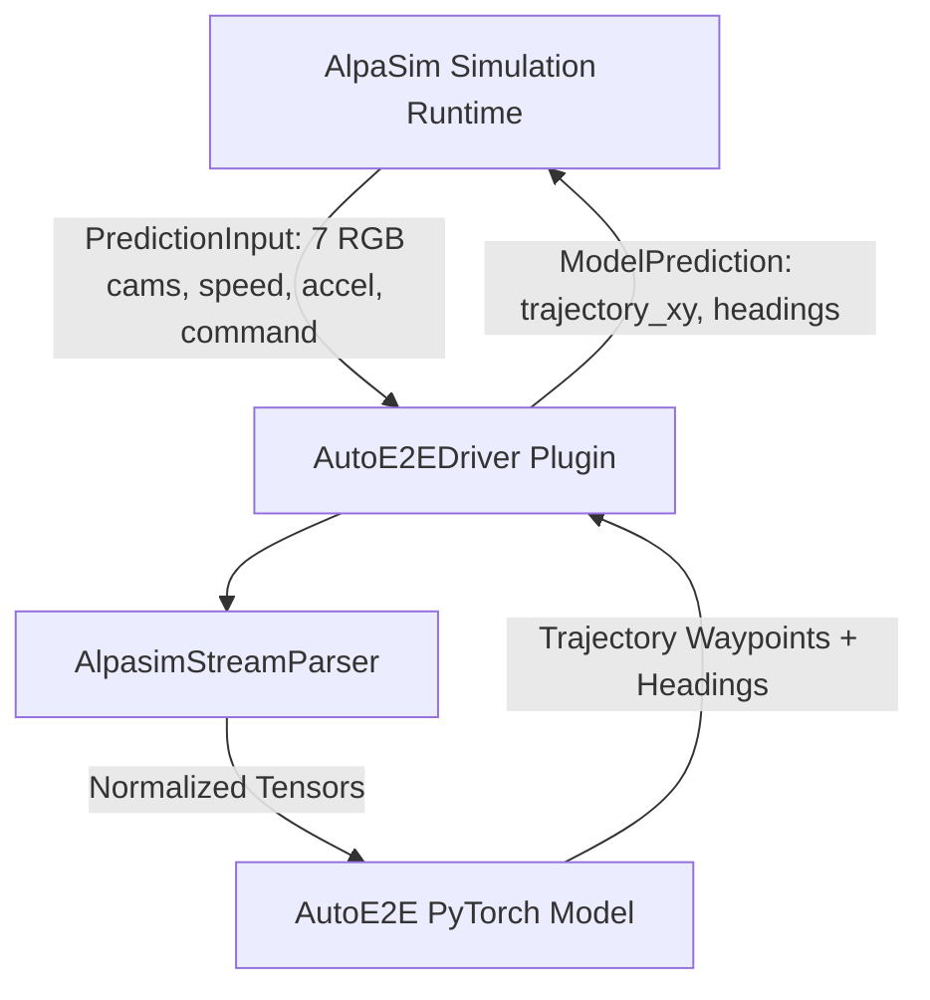

# AutoE2E AlpaSim Driver Plugin

This package provides the official **AutoE2E driver plugin** for [NVIDIA AlpaSim](https://github.com/NVlabs/alpasim), enabling real-time closed-loop evaluation and policy rollouts of the AutoE2E VLA driving model on the KitScenes 7-camera sensor topology.

For full official setup, microservices architecture, and execution details, refer to the [NVIDIA AlpaSim GitHub Repository](https://github.com/NVlabs/alpasim).

---

## Architecture Overview

The plugin connects AutoE2E directly to AlpaSim's microservices simulation loop without custom networking overhead.



### Key Components

- **`AutoE2EDriver`** ([`plugin.py`](./plugin.py)): Subclass of AlpaSim's `BaseTrajectoryModel`. Implements `from_config()`, `camera_ids`, `context_length`, `output_frequency_hz`, and `predict()`.
- **`AutoE2EAlpaSimConfig`** ([`config.py`](./config.py)): Dataclass defining model checkpoint paths, 7-camera topology configuration, and trajectory horizon parameters.
- **Entry Points** ([`pyproject.toml`](./pyproject.toml)): Registers `autoe2e` under entry point groups `alpasim.models` and `alpasim.configs`.
- **Driver Configs** ([`configs/driver/`](./alpasim_autoe2e/configs/driver/)): Contains `autoe2e.yaml` and `autoe2e_configs.yaml`. These files formally register the 7-camera KIT topology with AlpaSim to override the default renderer camera setup, avoiding `KeyError`s during closed-loop simulation.

---

## Data Contract & Sensor Topology

### Input Observations (`PredictionInput`)
- **Visual Topology**: 7 KitScenes camera streams (`camera_base_front_center`, `camera_ring_front`, `camera_ring_front_left`, `camera_ring_front_right`, `camera_ring_rear`, `camera_ring_rear_left`, `camera_ring_rear_right`).
- **Telemetry**: Scalar ego vehicle speed ($\text{m/s}$), acceleration ($\text{m/s}^2$), and high-level routing `DriveCommand` (LEFT, STRAIGHT, RIGHT).

### Output Predictions (`ModelPrediction`)
- **`trajectory_xy`**: Waypoint coordinates $[64, 2]$ in rig frame ($X$ forward, $Y$ left).
- **`headings`**: Vehicle target headings $[64]$ in radians.

---

## Installation & Setup

### 1. Install Driver & Dependencies

Install the driver plugin and dataset parser in editable mode:

```bash
# 1. Install alpasim_driver plugin package
pip install -e Model/plugins/alpasim_driver

# 2. Install KITScenes SDK
pip install -e Model/data_parsing/kit_scenes/kitscenes --no-deps

# 3. Install Lanelet2 (for vector HD map parsing & BEV rasterization)
pip install lanelet2
```

### 2. Environment Configuration

Configure root directories for KITScenes dataset files and AlpaSim source repository. You can source them from `.env` or export them manually:

```bash
# Option A: Load from .env file
set -a; source .env; set +a

# Option B: Set environment variables manually
export KITSCENES_ROOT="/path/to/auto_e2e/.KITdata"
export ALPASIM_ROOT="/path/to/auto_e2e/.alpasim"
```

### 3. Download KITScenes Data Samples

Download dataset scene archives using the `kitscenes` CLI:

```bash
python -m kitscenes.download "$KITSCENES_ROOT" --scenes c34c778f-ad8c-0aa9-7e1a-c86a73f887c7
```

---

## Model Control Parameters

Controls for simulation execution in [`config.py`](./config.py) and [`plugin.py`](./plugin.py):

| Parameter | Type | Default | Description |
| :--- | :--- | :--- | :--- |
| `checkpoint_path` | `str` | `"autoe2e_model.ckpt"` | Path to pre-trained AutoE2E PyTorch checkpoint file. |
| `allow_untrained_model` | `bool` | `False` | When `True`, initializes a fresh `AutoE2E(num_views=7)` PyTorch neural network with random weights if no checkpoint file exists on disk. |
| `allow_mock` | `bool` | `False` | When `False` (default), strictly requires the actual AlpaSim runtime and real model execution, failing fast if dependencies are missing. |

---

## Plugin Discovery Verification

Confirm that AlpaSim discovers the `autoe2e` plugin entry points:

```python
import alpasim_driver.plugin
import alpasim_plugins.plugins as p

print("Registered Models:", p.PluginRegistry("alpasim.models").get_names())
print("Registered Configs:", p.PluginRegistry("alpasim.configs").get_names())
```

**Expected Output**:
```text
Registered Models: ['autoe2e']
Registered Configs: ['autoe2e']
```

---

## Workflows & Official Documentation

### 1. Build the Driver Container Image
Before running the simulation, you must build a custom Docker image that extends the default AlpaSim base image with this driver plugin installed.

Create a `Dockerfile.driver` in the root of the `auto_e2e` repository:

```dockerfile
# Start from the base AlpaSim image
FROM alpasim-base:0.111.0

# Copy the necessary Model directories into the container
COPY Model/ /app/Model/

# Install the dependencies, clone the KITScenes SDK, and install the driver plugin
RUN pip install lanelet2 && \
    git clone https://github.com/KIT-MRT/kitscenes.git /app/Model/data_parsing/kit_scenes/kitscenes && \
    pip install -e /app/Model/data_parsing/kit_scenes/kitscenes --no-deps && \
    pip install -e /app/Model/plugins/alpasim_driver
```

Then build the image (from the `auto_e2e` root directory):
```bash
docker build -t alpasim-base:latest -f Dockerfile.driver .
```

### 2. Run the Closed-Loop Simulation
Once the image is built, use the `alpasim_wizard` from the `.alpasim` containerized environment. Execute:

```bash
# From the .alpasim root directory:
uv run --project src/wizard alpasim_wizard \
    deploy=local \
    topology=1gpu \
    driver=autoe2e \
    wizard.log_dir=$PWD/outputs/autoe2e_closed_loop_run \
    defines.base_image=alpasim-base:latest
```

*Note: For the NuRec 3DGS renderer to successfully boot and render the 7 KIT cameras, the selected dataset scene must have `.usdz` artifacts compiled and available in the scene cache.*

For further details on official CLI workflows and AlpaSim architecture, refer to the [NVIDIA AlpaSim GitHub Repository](https://github.com/NVlabs/alpasim).