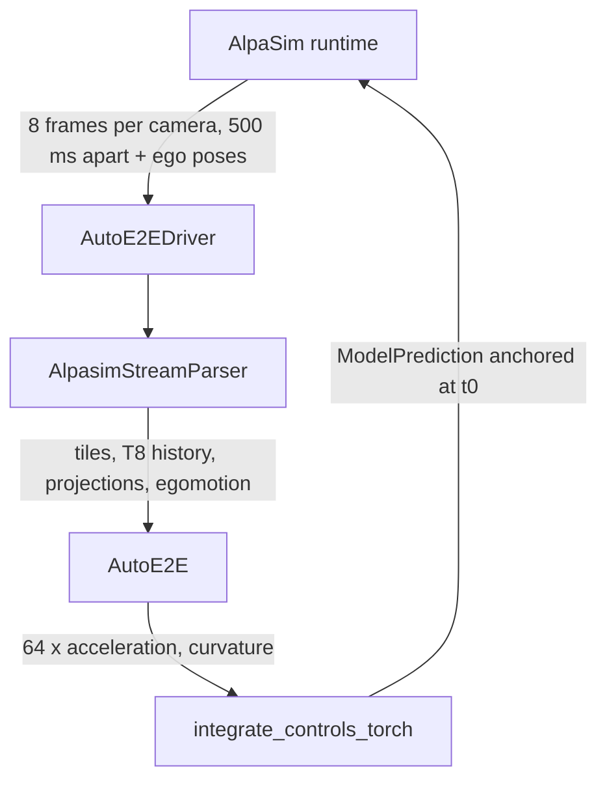

# AutoE2E AlpaSim Driver Plugin

This package plugs the AutoE2E reactive policy into [NVIDIA AlpaSim](https://github.com/NVlabs/alpasim) as a driver model, for closed-loop evaluation and RL rollouts.

It supports the released reactive BEVFormer T8 checkpoints (`view_fusion_kwargs.architecture == "bevformer_v2_t8"`, e.g. nuPlan Epoch 5 and KITScenes Epoch 5).

## How it works


```mermaid
graph TD
    AlpaSim[AlpaSim runtime] -->|8 frames per camera, 500 ms apart + ego poses| Driver[AutoE2EDriver]
    Driver --> Parser[AlpasimStreamParser]
    Parser -->|tiles, T8 history, projections, egomotion| Model[AutoE2E]
    Model -->|64 x acceleration, curvature| Rollout[integrate_controls_torch]
    Rollout -->|ModelPrediction anchored at t0| AlpaSim
```

- **`AutoE2EDriver`** ([`plugin.py`](./alpasim_autoe2e/plugin.py)) is an AlpaSim `BaseTrajectoryModel`, registered as `autoe2e` under the `alpasim.models` entry point. It rebuilds AutoE2E from the `config` stored in the checkpoint and reads the input contract (camera slots, tile sizes) from it. It then integrates the predicted controls with the training rollout (`training/losses/control_rollout.py`). The result is returned as waypoints anchored at `t0`, the timestamp of the newest camera frame.
- **`AlpasimStreamParser`** ([`parser.py`](./alpasim_autoe2e/parser.py)) builds the same tensors as the packed training data (`data_parsing/pre_extracted.py`, `data_parsing/kit_scenes`):

| Input | Built from |
| :--- | :--- |
| `camera_tiles` `[1,6,3,512,512]` | Newest frame of each camera, squashed to a square, ImageNet-normalised. The front tile is downsampled from the native 1024 px tile. |
| `front_camera_tile` `[1,3,1024,1024]` | Newest front frame, when the rig profile sets `native_front_camera_tile`. |
| `camera_history_tiles` `[1,7,6,3,512,512]` | The seven previous frames, 500 ms apart. |
| projections | `K_scaled @ inv(camera_to_reference)`. History projections map current-ego points into each past image (`reference_frame: current_ego`), using the ego poses interpolated at the frame timestamps. |
| `egomotion_history` `[1,256]` | 64 rows of `[speed, acceleration, yaw_rate, curvature]` before `t0`, from the ego poses by `np.gradient` on a 10 Hz grid. The dataset policy masks the newest acceleration (KITScenes). |
| `map_context`, `route_mask` | All zeros, with `map_valid = route_valid = False`. AlpaSim's model API passes no map, so the model runs on its evaluated camera-only track. |

Against packed KITScenes v3.5 samples rebuilt from raw `poses.txt`, the projections match to 1e-5 px. The egomotion matches to within 1e-2 (see `test_projections_and_egomotion_match_packed_kitscenes_samples`). The camera tiles match within JPEG noise.

## Rig profiles

[`configs/calibration/`](./alpasim_autoe2e/configs/calibration/) holds one JSON file per dataset rig. Each file stores native intrinsics, image size, camera-to-reference extrinsics and the model slot of every camera. The driver picks the profile whose cameras equal `driver.inference.use_cameras`.

- `kit_scenes.json` was exported with [`tools/export_kitscenes_calibration.py`](./tools/export_kitscenes_calibration.py). It matches 89 of the 117 KITScenes validation scenes. The other 28 use two later calibration revisions (25 and 3 scenes), each about 7 cm and 1° from it. For a world recorded with a later revision, export its profile and set `AUTOE2E_RIG_PROFILE=/path/to/profile.json`.
- `nuplan.json` is the nuPlan v1.1 rig of vehicle veh-35, exported from one of its log databases with [`tools/export_nuplan_calibration.py`](./tools/export_nuplan_calibration.py). The cameras keep their channel names (`CAM_F0`, ...). Training undistorts nuPlan images, so the profile holds the rectified pinhole intrinsics, and the world must render rectified cameras. All vehicles except veh-08 share the intrinsics, and their extrinsics differ by at most 9 cm and 2.8°. For a world recorded with another vehicle, export that vehicle's profile and set `AUTOE2E_RIG_PROFILE`.
- `nuplan_nurec.json` is the same rig on NVIDIA camera IDs, for NuRec scenes of the NVIDIA rig (see `driver=autoe2e_nuplan` below).
- A profile also states the dataset's curvature rule (`egomotion`): KITScenes divides by `max(speed, 0.1)`, while nuPlan zeroes curvature below 0.5 m/s and clips it to ±0.5.
- The reference frame of a profile must be the rig frame of the rendered world. For KITScenes, that is the frame of `poses.txt`; for nuPlan, the ego pose.

## Configuration

`driver=autoe2e` selects [`configs/driver/autoe2e.yaml`](./alpasim_autoe2e/configs/driver/autoe2e.yaml). Its runtime settings are in [`autoe2e_configs.yaml`](./alpasim_autoe2e/configs/driver/autoe2e_configs.yaml).

| Setting | Value | Why |
| :--- | :--- | :--- |
| `driver.model.checkpoint_path` | required | A training checkpoint. `MOCK` drives straight without a model, to test the simulator plumbing with any driver config; `UNTRAINED` builds the release architecture with random weights. |
| `driver.inference.context_length`, `subsample_factor` | `8`, `5` | Every 5th of the 10 Hz frames: the T8 history at 500 ms. |
| `runtime.simulation_config.force_gt_duration_us` | `7_000_000` | The ego follows the recording for 7 s, so the 6.4 s egomotion history and the 3.5 s camera history are real before AutoE2E drives. |
| `runtime.simulation_config.cameras` | native aspect ratio | The plugin squashes frames to square tiles, as in training. |
| `services.driver.environments` | `AUTOE2E_MODEL_ROOT=/mnt/drivers/autoe2e/Model` | Where the driver container finds the AutoE2E model code. |

`driver=autoe2e_nuplan` drives the nuPlan v1.1 rig, for example with the nuPlan Epoch 5 checkpoint, in NuRec scenes of the NVIDIA camera rig. AlpaSim's `runtime.extra_cameras` can only override cameras a scene already has. So the six nuPlan cameras are rendered as rectified pinhole cameras on six NVIDIA camera IDs, the way AlpaSim's Transfuser plugin renders its nuPlan-style rig, and `nuplan_nurec.json` maps them back. `nuplan.json` keeps the `CAM_*` names for worlds reconstructed from nuPlan. [`tools/profile_to_extra_cameras.py`](./tools/profile_to_extra_cameras.py) regenerates them from the profile, and a test keeps the two identical.

`driver.model` may only hold keys of AlpaSim's `ModelConfig`; the driver rejects any other key at startup.

## Running in AlpaSim

The plugin imports the AutoE2E model code from the repository's `Model/` directory. In-repo it finds it on its own; elsewhere, set `AUTOE2E_MODEL_ROOT`.

```bash
# 1. Checkpoint and model code under the wizard's defines.filesystem/drivers (/mnt/drivers in the container)
mkdir -p "$ALPASIM_FILESYSTEM/drivers/autoe2e"
cp /path/to/checkpoint.pt "$ALPASIM_FILESYSTEM/drivers/autoe2e/"
rsync -a --exclude tests Model/ "$ALPASIM_FILESYSTEM/drivers/autoe2e/Model/"

# 2. The plugin as an AlpaSim workspace member (Docker cannot follow symlinks out of its context)
rm -rf "$ALPASIM_ROOT/plugins/alpasim_driver"
cp -r Model/plugins/alpasim_driver "$ALPASIM_ROOT/plugins/"
```

Next, add `autoe2e = ["alpasim_autoe2e"]` to the plugin extras in `$ALPASIM_ROOT/pyproject.toml`, and `--extra autoe2e` to the `uv sync` line of its `Dockerfile`. Then build the image and run:

```bash
cd "$ALPASIM_ROOT" && uv run --project src/wizard alpasim_wizard \
    deploy=local topology=1gpu driver=autoe2e_nuplan \
    driver.model.checkpoint_path=/mnt/drivers/autoe2e/checkpoint.pt \
    defines.base_image=alpasim-base:latest \
    wizard.log_dir=$PWD/outputs/autoe2e_closed_loop_run \
    "hydra.searchpath=[file://$ALPASIM_ROOT/plugins/alpasim_driver/alpasim_autoe2e/configs]"
```

The wizard runs on the host, where the plugin is not installed, so `hydra.searchpath` points it at the plugin's configs; the driver itself runs inside the image.

The scene must render the rig's cameras. For KITScenes, that means a reconstruction that contains the six KITScenes cameras.

## Performance

Measured with the nuPlan Epoch 5 checkpoint and `driver=autoe2e_nuplan` on the AlpaSim sample scene `clipgt-01d503d4`. The scene renders six cameras: `CAM_F0` at 1920×1080 and the other five at 960×540. The driver was measured on a Tesla V100-PCIE-16GB, and the renderer on an RTX 4050 Laptop GPU.

| Service | Peak GPU memory |
| :--- | ---: |
| AutoE2E driver (fp32) | 3.2 GiB per process, CUDA context included (PyTorch: 1.96 GiB allocated, 2.84 GiB reserved) |
| NuRec renderer | 4.8 GiB |
| Physics | 0.2 GiB |
| **Closed loop on one GPU** (`topology=1gpu`) | **about 8.2 GiB** |

| Step | V100 | RTX 4050 Laptop | CPU |
| :--- | ---: | ---: | ---: |
| AutoE2E decision | 10.5 s (19 s on the first call) | 23 s | 7.9 min, 3.7 GB RAM |
| Render and physics, per 0.1 s step | | 0.32 s | |
| Scene load | | 48 s | |

One decision recomputes the BEV of all eight frames, and nearly all of that time is spent in the BEVFormer view fusion; parsing takes 0.15 s. fp16 autocast does not make it faster. AutoE2E decides every 0.1 s of simulated time, so the closed loop waits for the driver and runs about 100× slower than real time on a V100. A 20 s scene (the 7 s warm-up, then 130 decisions) takes about 24 minutes.

The whole loop on one GPU therefore needs at least 10 GB. On a 6 GB GPU, run the driver on the CPU with `driver.model.device=cpu`. That is how `driver=autoe2e_nuplan` and the nuPlan Epoch 5 checkpoint completed a closed-loop rollout of `clipgt-01d503d4` on a laptop.

## Tests

```bash
cd Model
python -m pytest tests/test_alpasim_stream.py tests/test_rewards.py                   # unit tests
AUTOE2E_CHECKPOINT=/path/to/checkpoint.pt \
KITSCENES_VAL_MIRROR=/path/to/kitscenes-val/v3.5/shards \
KITSCENES_RAW=/path/to/kitscenes/scenes \
python -m pytest tests/test_alpasim_stream.py -m integration                          # real model and parity
```

## Rewards

[`rewards.py`](./alpasim_autoe2e/rewards.py) holds the phase-1 reward agreed in [#123](https://github.com/autowarefoundation/auto_e2e/issues/123) and [#177](https://github.com/autowarefoundation/auto_e2e/pull/177): `GroundTruthDeviationReward`.

- **Tracking term:** for each AutoE2E decision, `-(w_ade·ADE + w_fde·FDE)` between the plan and the recorded drive at the same timestamps.
- **Renderer validity bound:** once the ego itself is more than 3 m from the recording, a −10 penalty is added and `truncated` is set. The reconstruction is only reliable near the recorded path, so this bound does not share the tracking weight.

[`tools/score_rollout.py`](./tools/score_rollout.py) applies the reward to an AlpaSim `rollout.asl`. The driver does not call the reward; the RL loop will (see `Design/reinforcement_learning.md`, which lists the further terms as future work).
