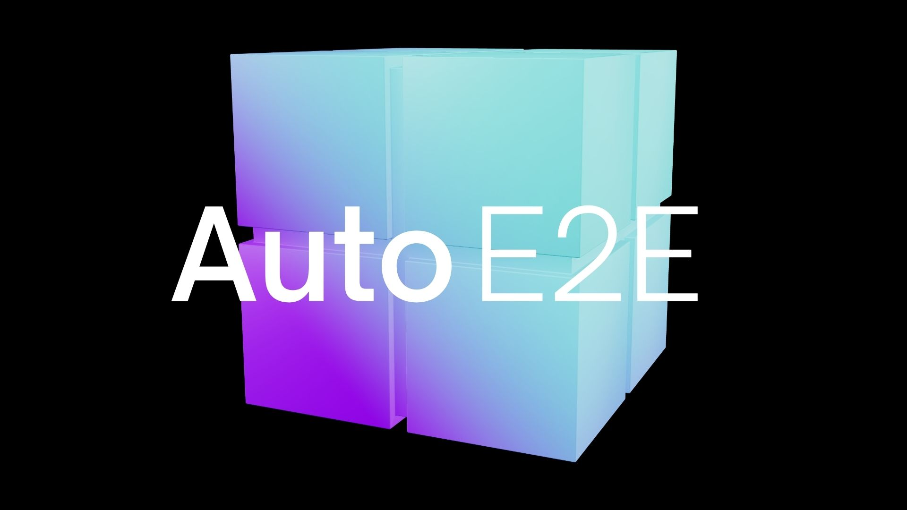
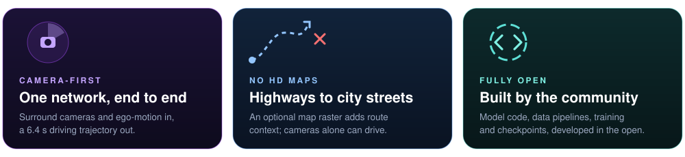
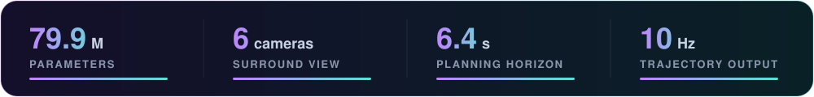
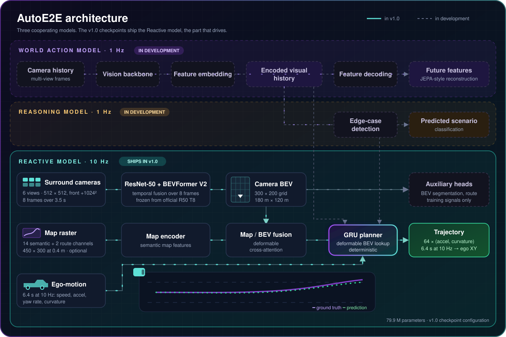
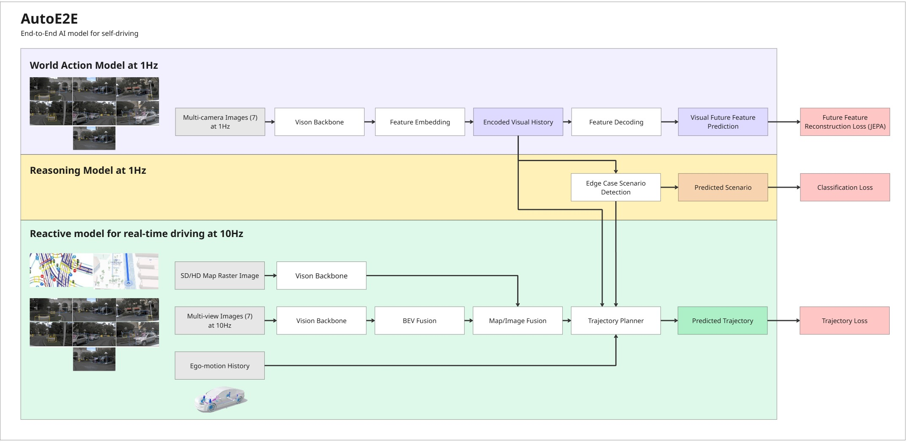

# AutoE2E - End-to-End AI for Self Driving

<p align="center">
    <picture>
        <source media="(prefers-color-scheme: dark)">
        
    </picture>
</p>

<p align="center">
  <a href="https://huggingface.co/AutowareFoundation/auto_e2e">
    
  </a>
</p>

<p align="center">
  <b>An open-source, camera-first End-to-End driving model for highways, arterial roads and city streets.</b>
</p>

<p align="center">
  <a href="https://huggingface.co/AutowareFoundation/auto_e2e"></a>
  <a href="https://github.com/autowarefoundation/auto_e2e/stargazers"></a>
  <a href="https://discord.com/invite/Q94UsPvReQ"></a>
  <a href="https://opensource.org/licenses/Apache-2.0"></a>
  
</p>

<br>

<p align="center">
  
</p>

AutoE2E plans the vehicle's trajectory directly from surround cameras. Fuse its output with LiDAR and radar safety layers for **driverless robotaxis**, or run it camera-only for **L2++ hands-free ADAS**.

<p align="center">
  
</p>



<p align="center">
  
</p>

AutoE2E is three cooperating models. The **Reactive model** runs at 10 Hz and drives: it lifts six surround cameras into a bird's-eye-view grid, optionally fuses a map raster, and lets a GRU planner turn that scene plus ego-motion history into the next 6.4 s of acceleration and curvature. The 1 Hz **World Action** and **Reasoning** models are in development. The [Model guide](./Model/) has the full inputs, outputs and forward signature.

<details>
  <summary>Original design diagram</summary>
  <br>
  
</details>

## Pretrained checkpoints on Hugging Face

The [AutoE2E v1.0 release on Hugging Face](https://huggingface.co/AutowareFoundation/auto_e2e)
provides two trajectory-planning checkpoints with their evaluation reports:

- **nuPlan Epoch 5**, the baseline model trained on nuPlan;
- **KITScenes Epoch 5**, the same model fine-tuned on KITScenes-Multimodal.

The model card lists ADE/FDE on the KITScenes validation and official test splits and
includes a loading example. The KITScenes validation shards used by the community
benchmark are published in the same repository.

## DataModelConsole dashboard

The read-only [DataModelConsole production dashboard](https://d2itskdqq39tx1.cloudfront.net/)
brings AutoE2E datasets, model results and pipeline state into one workspace. Use it to:

- inspect published dataset versions, shards, samples and geographic coverage;
- play synchronized seven-camera scenes with ego-state and map context;
- compare ground-truth and model-predicted trajectories in camera and bird's-eye views;
- explore reasoning labels, MLflow models and Flyte executions.

## Getting started

Requires **Python 3.12** (the pinned PyTorch build has no wheels for 3.13+).

### Using `make` tool ###
<details open>
  <summary>Toggle view</summary>

1. **Clone and install dependencies**

   ```bash
   git clone https://github.com/autowarefoundation/auto_e2e.git
   cd auto_e2e
   make setup                      # CPU torch wheels
   make setup TORCH_CHANNEL=cu118  # or a CUDA build (cu121, ... work too)
   ```

2. **Verify the install** (optional)

   ```bash
   make test
   ```
</details>

### Using plain pip ###
<details open>
  <summary>Toggle view</summary>

**Clone and install dependencies**

```bash
git clone https://github.com/autowarefoundation/auto_e2e.git
cd auto_e2e
pip install -r requirements.txt                      # CPU torch wheels
pip install -r requirements.txt --extra-index-url https://download.pytorch.org/whl/cu118  # or a CUDA build (cu121, ... work too)
```

Without a `make` tool, you unfortunately cannot verify the install 
using a `test` from the Makefile. It is highly recommended to install 
the tool through a [package manager](https://chocolatey.org/).

</details>

### Documentation

Review our academic paper, access our knowledge base and read through our work on safety verification in our documentation pages, alongside more information about the AutoE2E model at [https://autowarefoundation.github.io/auto_e2e/](https://autowarefoundation.github.io/auto_e2e/)

### Next steps
- Explore the [Model](./Model/) folder for the model components, training and inference.
- Follow the [Trial Guide](./TRIAL.md) to run the inference test on AWS EC2.

## Performance

Up to **~76 FPS** (SwinV2-Tiny, feature-concat fusion, RTX 5080, batch 1). Full per-GPU
inference benchmarks covering latency, jitter and VRAM across backbones, fusion modes and
batch sizes live in [BENCHMARKS.md](./Model/speed_benchmark/BENCHMARKS.md). Run the
[benchmarking script](./Model/speed_benchmark) to add results for your own GPU.
